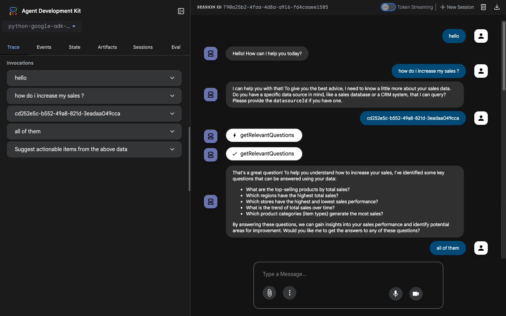

# Python Google ADK Trusted Auth MCP Client

This is a Google ADK (Agent Development Kit) agent that connects to ThoughtSpot via MCP (Model Context Protocol) to query and retrieve data from ThoughtSpot data models using ThoughtSpot AI capabilities.



## Setup

Clone the developer examples repo.
```bash
git clone https://github.com/thoughtspot/developer-examples
```
Navigate to the example directory.
```bash
cd mcp/python-google-adk-trusted-auth
```

1. **Install dependencies:**
   ```bash
   pip install -r requirements.txt
   ```

2. **Set up environment variables:**
   ```bash
   # Copy the template
   cp env.template .env
   
   # Edit .env with your actual values
   TS_SECRET_KEY=your_thoughtspot_secret_key
   TS_HOST=your_thoughtspot_host_here
   GOOGLE_API_KEY=your-gemini-key-here
   ```

3. **Run with ADK:**
   ```bash
   adk run
   ```
   OR
   ```bash
   cd ../
   adk web
   ```

## Trusted Auth Server Integration

This project includes integration with the [ThoughtSpot trusted auth](https://developers.thoughtspot.com/docs/trusted-auth).

- **Authentication Token Management**: Generate and manage ThoughtSpot authentication token
- **User Group Management**: Handle user groups and permissions


## References

- **[ThoughtSpot MCP Server](https://github.com/thoughtspot/mcp-server)** - The MCP server implementation used in these examples
- **[Google Agent development kit(ADK)](https://google.github.io/adk-docs/tools/mcp-tools/)** - Google Agent development kit(ADK) used in the Python examples
- **[Model Context Protocol](https://modelcontextprotocol.io/)** - Official MCP specification and documentation


## Requirements

- Python 3.8+
- Google ADK
- ThoughtSpot MCP server access
- Valid ThoughtSpot secret key

