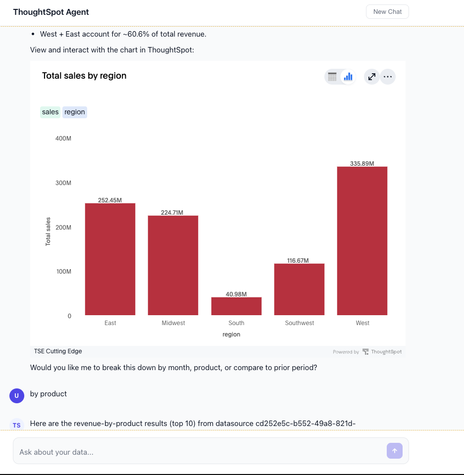

# Python Agent with Simple React UI

A full-stack example that pairs a **Python (FastAPI) agent** powered by the OpenAI Responses API and ThoughtSpot MCP server with a **React chat UI**.

The backend streams responses to the frontend using Server-Sent Events (SSE), giving users a real-time chat experience while the agent queries ThoughtSpot for data insights and displays ThoughtSpot charts in
an embed. Supports trusted auth and other standard thoughtspot customizations.

## Screenshot



## Architecture

```
┌──────────────┐   SSE stream   ┌──────────────┐   MCP    ┌─────────────┐
│  React Chat  │ ◄────────────► │  FastAPI      │ ◄──────► │ ThoughtSpot │
│  (Vite)      │   /api/chat    │  + OpenAI     │          │ MCP Server  │
└──────────────┘                └──────────────┘          └─────────────┘
     :5173                           :8000           agent.thoughtspot.app
```

1. User sends a message from the React UI
2. FastAPI backend forwards it to OpenAI Responses API with the ThoughtSpot MCP tool
3. OpenAI calls ThoughtSpot tools as needed, and streams the response
4. Backend forwards text deltas and status events to the UI over SSE
5. React renders the streamed markdown response in real time

## Prerequisites

- Python 3.10+
- Node.js 18+
- Azure OpenAI endpoint and API key (or an OpenAI-compatible endpoint)
- ThoughtSpot instance with:
  - Host URL
  - Authentication token (Bearer token)

## Quick Start

### 1. Configure environment

From the project root (`python-react-agent-simple-ui/`):

```bash
cp env.template .env
```

Edit `.env` with your credentials:

```env
# Server-side (used by the Python agent)
AZURE_OPENAI_ENDPOINT=https://your-resource.openai.azure.com/openai/v1
AZURE_OPENAI_KEY=your_azure_openai_key_here

# Client-side (prefix with VITE_ so Vite exposes them to the browser)
VITE_TS_HOST=your-instance.thoughtspot.cloud
VITE_TS_AUTH_TOKEN=your_thoughtspot_bearer_token
```

The Python server reads `AZURE_OPENAI_*` and `VITE_TS_*` variables from this `.env` file. The Vite client reads variables prefixed with `VITE_` via `import.meta.env`.

### 2. Start the backend

```bash
cd server
python -m venv .venv
source .venv/bin/activate   # Windows: .venv\Scripts\activate
pip install -r requirements.txt
uvicorn agent:app --reload
```

The API will be running at `http://localhost:8000`.

### 3. Start the frontend

In a separate terminal:

```bash
cd client
npm install
npm run dev
```

Open `http://localhost:5173` in your browser. The Vite dev server proxies `/api` requests to the FastAPI backend.

## Project Structure

```
python-react-agent-simple-ui/
├── .env                   # Shared env vars (create from env.template)
├── env.template           # Environment variable template
├── server/
│   ├── agent.py           # FastAPI server with OpenAI Responses API + MCP
│   └── requirements.txt   # Python dependencies
├── client/
│   ├── package.json       # Node dependencies
│   ├── vite.config.js     # Vite config with API proxy + envDir
│   ├── index.html         # HTML entry point
│   └── src/
│       ├── main.jsx       # React entry point
│       ├── App.jsx        # Chat UI component
│       └── App.css        # Styles
└── README.md
```

## How It Works

### Backend (`server/agent.py`)

- Uses the **OpenAI Responses API** with `stream=True` for real-time generation
- Configures the **ThoughtSpot MCP server** as a tool — OpenAI handles MCP communication server-side
- Supports **multi-turn conversations** via `previous_response_id` — the API maintains conversation context automatically
- Streams **SSE events** to the frontend: `delta` (text), `status` (tool call progress), `done` (response complete), `error`

### Frontend (`client/src/App.jsx`)

- Reads the SSE stream using `fetch` + `ReadableStream` API
- Renders assistant responses as **markdown** with table and code block support
- Shows **real-time status** while the agent connects to and queries ThoughtSpot
- Tracks `response_id` across turns for seamless multi-turn conversation

## Customization

### Change the model

In `server/agent.py`, modify the `model` parameter:

```python
"model": "gpt-5",  # or gpt-5-mini, gpt-4.1-mini, etc.
```

### Restrict available tools

Add the `allowed_tools` key to the MCP tool config to limit which ThoughtSpot tools the agent can use:

```python
MCP_TOOL = {
    ...
    "allowed_tools": ["ping", "search_data", "get_answer"],
}
```

### Use standard OpenAI instead of Azure

Update the `.env` variables and client initialization in `server/agent.py`:

```python
openai_client = OpenAI(
    api_key=os.getenv("OPENAI_API_KEY"),
)
```

## Troubleshooting

| Issue | Fix |
|---|---|
| `AZURE_OPENAI_KEY` / endpoint errors | Make sure `.env` exists in the project root and contains valid Azure OpenAI credentials |
| ThoughtSpot auth errors | Verify `VITE_TS_AUTH_TOKEN` is valid and `VITE_TS_HOST` is correct |
| CORS errors in browser | Ensure FastAPI server is running on port 8000 |
| Blank responses | Check FastAPI logs for streaming errors |

## Learn More

- [OpenAI Responses API](https://platform.openai.com/docs/api-reference/responses)
- [ThoughtSpot Developer Docs](https://developers.thoughtspot.com)
- [Model Context Protocol](https://modelcontextprotocol.io)
