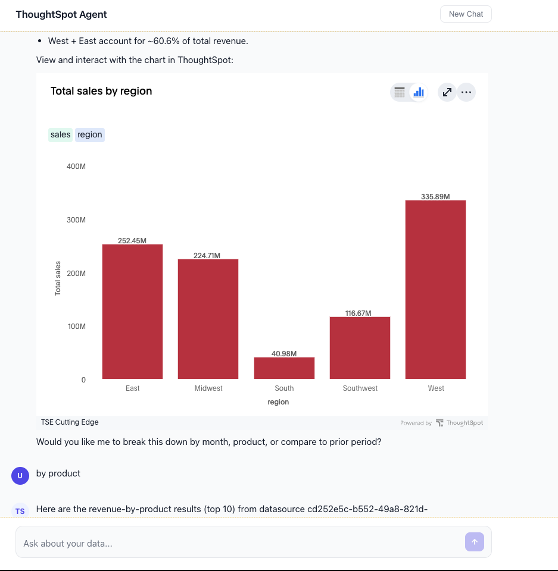

<!-- search-meta
tags: [MCP, Python, React, FastAPI, SSE, streaming, OpenAI, Anthropic, Claude, ThoughtSpot-MCP, full-stack]
apis: [ThoughtSpotMCPServer, OpenAIResponsesAPI, AnthropicAPI, ClaudeAPI, FastAPI, SSE, MCPClient]
questions:
  - How do I build a chat UI that connects to ThoughtSpot via MCP?
  - How do I stream ThoughtSpot MCP responses to a React frontend using SSE?
  - How do I build a full-stack ThoughtSpot AI chat application with Python and React?
  - How do I use Server-Sent Events with ThoughtSpot MCP in a FastAPI Python server?
  - How do I use Claude with ThoughtSpot MCP server?
  - How do I use client-side MCP tool calling with custom headers?
-->

# Python Agent with Simple React UI

A full-stack example that pairs a **Python (FastAPI) agent** with a **React chat UI**. Supports two backend implementations:

| Backend         | File                                   | AI Provider           | MCP Integration                                |
|-----------------|----------------------------------------|-----------------------|------------------------------------------------|
| **v1 (OpenAI)** | `server/agent.py`                      | Azure OpenAI / OpenAI | Server-side (OpenAI manages MCP)               |
| **v2 (Claude)** | `server/claude_agent_mcp_server_v2.py` | Anthropic Claude      | Client-side (FastAPI connects to MCP directly) |
| **v2 (OpenAI)** | _(coming soon)_                        | Azure OpenAI / OpenAI | Client-side (FastAPI connects to MCP directly) |

<!-- TODO: The ThoughtSpot MCP server supports both OpenAI and Claude integrations. An OpenAI v2 example
     (client-side MCP with custom Authorization + x-ts-host headers, mirroring the Claude v2 architecture)
     is missing from this repository and should be added. -->

The backend streams responses to the frontend using Server-Sent Events (SSE), giving users a real-time chat experience while the agent queries ThoughtSpot for data insights and displays ThoughtSpot charts in an embed.

## Screenshot



---

## MCP Server v2: Claude + Client-side MCP (Recommended)

`claude_agent_mcp_server_v2.py` uses Anthropic's Claude API with a **client-side agentic loop** — the FastAPI process connects directly to the ThoughtSpot MCP server using custom HTTP headers (`Authorization` + `x-ts-host`). This approach is required because Anthropic's server-side MCP integration does not support custom headers.

### Architecture (v2)

```
┌──────────────┐   SSE stream   ┌──────────────────────┐   MCP (streamable-http)           ┌─────────────┐
│  React Chat  │ ◄────────────► │  FastAPI + Claude    │ ◄──────────────────────────────►  │ ThoughtSpot │
│  (Vite)      │   /api/chat    │  / OpenAI            │   Authorization + x-ts-host       │ MCP Server  │
└──────────────┘                └──────────────────────┘                                   └─────────────┘
     :5173                              :8000                                             agent.thoughtspot.app
```

**Request flow:**

1. User sends a message from the React UI
2. FastAPI opens a new MCP session to `agent.thoughtspot.app` with auth headers
3. Claude receives the user message + ThoughtSpot tool definitions
4. Claude calls ThoughtSpot tools as needed; FastAPI executes each call via the MCP session
5. The agentic loop continues until Claude stops calling tools
6. Text deltas and status events are streamed to the UI over SSE in real time

### Prerequisites (v2)

- Python 3.10+
- Node.js 18+
- Anthropic API key
- ThoughtSpot instance with a host URL and Authentication token(bearer token)

### Environment Setup (v2)

From the project root (`python-react-agent-simple-ui/`):

```bash
cp env.template .env
```

Edit `.env` — v2 uses these variables:

```env
# Server-side — used by the Claude agent
ANTHROPIC_API_KEY=your_anthropic_api_key_here

# ThoughtSpot credentials (VITE_ prefix makes them available to the React client too)
VITE_TS_HOST=your-instance.thoughtspot.cloud
VITE_TS_AUTH_TOKEN=your_thoughtspot_bearer_token
```

> **Note:** `VITE_TS_HOST` / `VITE_TS_AUTH_TOKEN` are read by both the Python server and the React client. You can also set them without the `VITE_` prefix as `TS_HOST` / `TS_AUTH_TOKEN` if you only need server-side access.

> **Warning:** Using a static bearer token is for development and demo purposes only. For production, implement the [Trusted Authentication](https://developers.thoughtspot.com/docs/trusted-auth) flow where your backend generates short-lived tokens per user.

### Running v2

**Backend:**

```bash
cd server
python -m venv .venv
source .venv/bin/activate   # Windows: .venv\Scripts\activate
pip install -r requirements.txt
uvicorn claude_agent_mcp_server_v2:app --reload
```

**Frontend** (separate terminal):

```bash
cd client
npm install
npm run dev
```

Open `http://localhost:5173`. The Vite dev server proxies `/api` to the FastAPI backend on port 8000.

### How v2 Works

#### Conversation management

v2 maintains full conversation history (including all tool interactions) in an in-memory dict keyed by `conv_id`. Each `/api/chat` request either starts a new conversation or continues an existing one by passing the `response_id` returned in the previous `done` event.

```
conversations: { conv_id → [user msg, assistant msg + tool calls, tool results, ...] }
```

#### Analytical session continuity

When the Claude model calls `create_analysis_session`, the server stores the returned `analytical_session_id` and injects it into the system prompt for all follow-up turns. This lets `send_session_message` / `get_session_updates` calls reference the same ThoughtSpot analytical session across multiple questions.

```
analytical_sessions: { conv_id → analytical_session_id }
```

#### Agentic loop

The loop inside `agent_loop()` runs until `stop_reason != "tool_use"`:

1. Call `claude_client.messages.stream(...)` with tools
2. Stream text deltas to the queue as SSE `delta` events
3. On `tool_use` stop: execute every tool call via the live MCP session
4. Append `assistant` turn + `tool_result` user turn to `current_messages`
5. Repeat from step 1

### Customization (v2)

#### Change the Claude model

In `claude_agent_mcp_server_v2.py`, update the `model` parameter in the `claude_client.messages.stream(...)` call:

```python
async with claude_client.messages.stream(
    model="claude-sonnet-4-6",  # or claude-haiku-4-5-20251001, etc.
    ...
)
```

#### System prompt

Edit `SYSTEM_PROMPT` to change agent behavior — tone, focus, or datasource:

```python
SYSTEM_PROMPT = (
    "You are a helpful data analyst assistant powered by ThoughtSpot. "
    # ...
    # Uncomment to force a specific datasource for all queries:
    # "Use this datasource: cd252e5c-b552-49a8-821d-3eadaa049cca to answer all data questions."
)
```

#### Restrict available tools

Set `ALLOWED_TOOLS` to a list of tool names to limit what the agent can call. Set to `None` to allow all tools.

```python
# Allow all tools (default)
ALLOWED_TOOLS = None

# Restrict to specific tools
ALLOWED_TOOLS = ["check_connectivity", "create_analysis_session", "send_session_message", "get_session_updates"]
```

#### Available ThoughtSpot MCP tools (v2)

The v2 MCP server exposes an **analytical session workflow** — a three-step loop to query data and retrieve visualizations:

| Tool                      | Inputs                                                                | Outputs                             | Description                                                                                                                                                                                                                                                                                                 |
|---------------------------|-----------------------------------------------------------------------|-------------------------------------|-------------------------------------------------------------------------------------------------------------------------------------------------------------------------------------------------------------------------------------------------------------------------------------------------------------|
| `check_connectivity`      | —                                                                     | `success`                           | Test connectivity and authentication. Call this if other tools are failing to verify the connection.                                                                                                                                                                                                        |
| `create_analysis_session` | `data_source_id` _(optional)_                                         | `analytical_session_id`             | Start a new analytical session. Provide `data_source_id` when the user has specified a source; omit it to let the Analytics Agent auto-select. Returns a session ID used in all subsequent calls. Sessions are conversational — ask follow-up questions without creating a new one.                         |
| `send_session_message`    | `analytical_session_id`, `message`, `additional_context` _(optional)_ | `success`                           | Send a natural-language question to an active session. The response is not returned immediately — poll with `get_session_updates`. Wait for `is_done: true` before sending another message. Use `additional_context` for background the Agent wouldn't otherwise know (e.g. "fiscal year starts in April"). |
| `get_session_updates`     | `analytical_session_id`                                               | `session_updates` (list), `is_done` | Poll for the latest incremental updates from the session. Call repeatedly until `is_done: true`. An empty `session_updates` list with `is_done: false` means the Agent is still thinking — keep polling. Each update has a `type` field:                                                                    |
| `create_dashboard`        | `title`, `answers` (list of `answer_id`s), `note_tile`                | `link`                              | Create a dashboard from one or more answers returned by `get_session_updates`. Returns a URL to the created dashboard.                                                                                                                                                                                      |

**`session_update` type definition** (items in the `session_updates` list):

| Field          | Present when                     | Description                                                                                                               |
|----------------|----------------------------------|---------------------------------------------------------------------------------------------------------------------------|
| `type`         | always                           | `"text"`, `"text_chunk"`, or `"answer"`                                                                                   |
| `text`         | `type` is `text` or `text_chunk` | Natural-language message from the Analytics Agent. Concatenate `text_chunk` values in order to form the complete message. |
| `answer_id`    | `type` is `answer`               | Unique identifier for the answer — use with `create_dashboard`.                                                           |
| `answer_title` | `type` is `answer`               | Human-readable title describing what the answer shows.                                                                    |
| `answer_query` | `type` is `answer`               | The search query the Analytics Agent used to generate the answer.                                                         |
| `iframe_url`   | `type` is `answer`               | Embeddable URL for rendering the answer as an interactive chart or table in an `<iframe>`.                                |

---

## v1: OpenAI / Azure OpenAI

`agent.py` uses the OpenAI Responses API with server-side MCP integration — OpenAI manages the MCP connection automatically.

### Architecture (v1)

```
┌──────────────┐   SSE stream   ┌──────────────┐   MCP    ┌─────────────┐
│  React Chat  │ ◄────────────► │  FastAPI      │ ◄──────► │ ThoughtSpot │
│  (Vite)      │   /api/chat    │  + OpenAI     │          │ MCP Server  │
└──────────────┘                └──────────────┘          └─────────────┘
     :5173                           :8000           agent.thoughtspot.app
```

### Environment Setup (v1)

```env
# Server-side
AZURE_OPENAI_ENDPOINT=https://your-resource.openai.azure.com/openai/v1
AZURE_OPENAI_KEY=your_azure_openai_key_here

# ThoughtSpot credentials
VITE_TS_HOST=your-instance.thoughtspot.cloud
VITE_TS_AUTH_TOKEN=your_thoughtspot_bearer_token
```

### Running v1

```bash
cd server
uvicorn agent:app --reload
```

### Customization (v1)

#### Change the model

```python
"model": "gpt-5",  # or gpt-5-mini, gpt-4.1-mini, etc.
```

#### Use Standard OpenAI Instead of Azure

```python
openai_client = OpenAI(
    api_key=os.getenv("OPENAI_API_KEY"),
)
```

#### System prompt and tool restrictions

Edit `SYSTEM_PROMPT` and `ALLOWED_TOOLS` in `agent.py`. The available tools for v1 are:

```python
# Allow all tools (default)
ALLOWED_TOOLS = None

# Restrict to specific tools
ALLOWED_TOOLS = ["ping", "getRelevantQuestions", "getAnswer", "createLiveboard", "getDataSourceSuggestions"]
```

| Tool                       | Description                                            |
|----------------------------|--------------------------------------------------------|
| `ping`                     | Test connectivity and authentication                   |
| `getRelevantQuestions`     | Get suggested data questions for a user query          |
| `getAnswer`                | Get the answer to a specific question from ThoughtSpot |
| `createLiveboard`          | Create a liveboard from a list of answers              |
| `getDataSourceSuggestions` | Get datasource suggestions for a query                 |

---

## Project Structure

```
python-react-agent-simple-ui/
├── .env                                  # Shared env vars (create from env.template)
├── env.template                          # Environment variable template
├── server/
│   ├── agent.py                          # v1: FastAPI + OpenAI Responses API + server-side MCP
│   ├── claude_agent_mcp_server_v2.py     # v2: FastAPI + Claude API + client-side MCP
│   └── requirements.txt                  # Python dependencies
├── client/
│   ├── package.json                      # Node dependencies
│   ├── vite.config.js                    # Vite config with API proxy + envDir
│   ├── index.html                        # HTML entry point
│   └── src/
│       ├── main.jsx                      # React entry point
│       ├── App.jsx                       # Chat UI component
│       └── App.css                       # Styles
└── README.md
```

---

## Frontend (`client/src/App.jsx`)

The React client is shared across both backends:

- Reads the SSE stream using `fetch` + `ReadableStream` API
- Renders assistant responses as **markdown** with table and code block support
- Renders ThoughtSpot charts as `<iframe>` embeds from `iframe_url` values in responses
- Shows **real-time status** while the agent connects to and queries ThoughtSpot
- Tracks `response_id` across turns for multi-turn conversation continuity

### Visual embed customization

All ThoughtSpot embed styling is configured in the `init()` call at the top of `client/src/App.jsx`:

```javascript
init({
  thoughtSpotHost: import.meta.env.VITE_TS_HOST,
  authType: AuthType.TrustedAuthTokenCookieless,
  getAuthToken: async () => {
    return import.meta.env.VITE_TS_AUTH_TOKEN;
  },
  customizations: {
    style: {
      customCSS: {
        variables: {
          "--ts-var-button-border-radius": "10px",
          "--ts-var-button--secondary-background": "#FDE9AF",
          "--ts-var-button--secondary--hover-background": "#FCD977",
          "--ts-var-menu-background": "#FDE9AF",
          // Full list of variables: https://developers.thoughtspot.com/docs/custom-css
        },
      },
    },
  },
});
```

---

## Troubleshooting

| Issue                                     | Fix                                                                    |
|-------------------------------------------|------------------------------------------------------------------------|
| `ANTHROPIC_API_KEY` errors (v2)           | Ensure `.env` in the project root contains a valid Anthropic API key   |
| `AZURE_OPENAI_KEY` / endpoint errors (v1) | Ensure `.env` contains valid Azure OpenAI credentials                  |
| ThoughtSpot auth errors                   | Verify `VITE_TS_AUTH_TOKEN` is valid and `VITE_TS_HOST` is correct     |
| MCP connection failures (v2)              | Check that the token has access to `agent.thoughtspot.app`             |
| CORS errors in browser                    | Ensure FastAPI server is running on port 8000                          |
| Blank responses                           | Check FastAPI logs for streaming or MCP errors                         |
| Follow-up questions lose context          | Ensure `response_id` is passed back in subsequent `/api/chat` requests |

---

## Learn More

- [Anthropic Claude API](https://docs.anthropic.com)
- [Model Context Protocol](https://modelcontextprotocol.io)
- [OpenAI Responses API](https://platform.openai.com/docs/api-reference/responses)
- [ThoughtSpot Developer Docs](https://developers.thoughtspot.com)
- [ThoughtSpot Trusted Auth](https://developers.thoughtspot.com/docs/trusted-auth)
