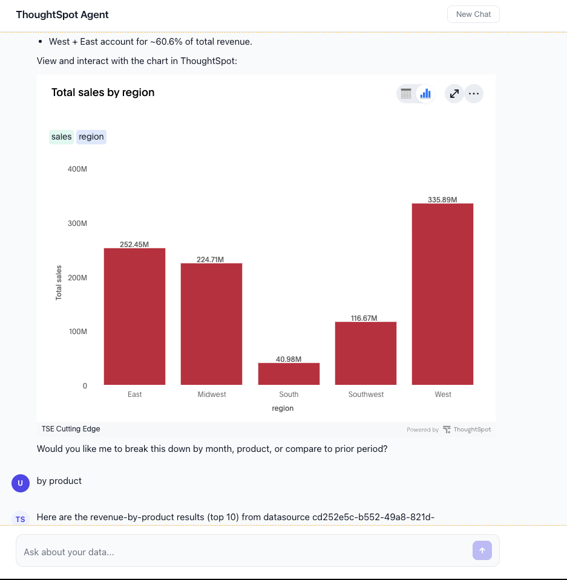

<!-- search-meta
tags: [MCP, Python, React, FastAPI, SSE, streaming, Anthropic, Claude, Spotter, ThoughtSpot-MCP, full-stack]
apis: [ThoughtSpotMCPServer, AnthropicAPI, ClaudeAPI, FastAPI, SSE, MCPClient, VisualEmbedSDK, startAutoMCPFrameRenderer]
questions:
  - How do I build a chat UI that connects to ThoughtSpot via MCP?
  - How do I stream ThoughtSpot MCP responses to a React frontend using SSE?
  - How do I build a full-stack ThoughtSpot AI chat application with Python and React?
  - How do I use Server-Sent Events with ThoughtSpot MCP in a FastAPI Python server?
  - How do I use Claude with ThoughtSpot MCP server?
  - How do I use client-side MCP tool calling with custom headers?
  - How do I render ThoughtSpot MCP charts with startAutoMCPFrameRenderer?
  - How do I poll get_session_updates for a ThoughtSpot analytical session?
  - How do I pin the ThoughtSpot MCP api-version?
-->

# Python Agent with Simple React UI

A full-stack example that pairs a **Python (FastAPI) agent** with a **React chat UI**, running against the ThoughtSpot MCP server's **Spotter 3** toolset. Two backends are included:

| Backend                 | File                                                               | What it gives you                                          |
|-------------------------|--------------------------------------------------------------------|------------------------------------------------------------|
| **Spotter 3**           | `server/claude_agent_with_spotter3_mcp_server.py`                  | The agent, with history held in memory for the process life |
| **Spotter 3 + history** | `server/claude_agent_with_spotter3_mcp_server_and_chat_history.py` | The same, plus SQLite history you can list, reopen and delete |

Both use Anthropic Claude with a client-side MCP loop — the FastAPI process connects to the MCP server directly.

The backend streams responses to the frontend using Server-Sent Events (SSE), giving users a real-time chat experience while the agent queries ThoughtSpot for data insights and displays ThoughtSpot charts in an embed.

## Screenshot



---

## Claude + the Spotter 3 MCP Server

`claude_agent_with_spotter3_mcp_server.py` uses Anthropic's Claude API with a **client-side agentic loop** — the FastAPI process connects directly to the [ThoughtSpot MCP server](https://github.com/thoughtspot/mcp-server) using custom HTTP headers (`Authorization` + `x-ts-host`). This is required because Anthropic's server-side MCP connector cannot send custom headers.

### Architecture

```
┌──────────────┐   SSE stream   ┌──────────────────────┐   MCP (streamable-http)           ┌─────────────┐
│  React Chat  │ ◄────────────► │  FastAPI + Claude    │ ◄──────────────────────────────►  │ ThoughtSpot │
│  (Vite)      │   /api/chat    │                      │   Authorization + x-ts-host       │ MCP Server  │
└──────────────┘                └──────────────────────┘                                   └─────────────┘
     :5173                              :8000                                             agent.thoughtspot.app
```

**Request flow:**

1. User sends a message from the React UI
2. FastAPI opens an MCP session to `agent.thoughtspot.app` with auth headers and fetches the tool list
3. Claude receives the user message + ThoughtSpot tool definitions
4. Claude calls ThoughtSpot tools; FastAPI executes each call over the MCP session
5. For `get_session_updates`, FastAPI polls the Analytics Agent to completion itself (see below)
6. Text deltas, agent progress, and rendered answers stream to the UI over SSE in real time

### Prerequisites

- Python 3.10+ (required by `anthropic` 1.x)
- Node.js 18+
- Anthropic API key
- ThoughtSpot instance with a host URL and an authentication (bearer) token

### Environment Setup

From the project root (`python-react-agent-simple-ui/`):

```bash
cp env.template .env
```

Edit `.env` — the agent uses these variables:

```env
# Server-side — used by the Claude agent
ANTHROPIC_API_KEY=your_anthropic_api_key_here

# ThoughtSpot credentials (VITE_ prefix makes them available to the React client too)
VITE_TS_HOST=your-instance.thoughtspot.cloud
VITE_TS_AUTH_TOKEN=your_thoughtspot_bearer_token

# Optional overrides
# ANTHROPIC_MODEL=claude-opus-5
# TS_MCP_API_VERSION=2026-05-01
# TS_MCP_URL=https://agent.thoughtspot.app/token/mcp?api-version=2026-05-01
```

> **Note:** `VITE_TS_HOST` / `VITE_TS_AUTH_TOKEN` are read by both the Python server and the React client. You can also set them without the `VITE_` prefix as `TS_HOST` / `TS_AUTH_TOKEN` if you only need server-side access.

> **Warning:** Using a static bearer token is for development and demo purposes only. For production, implement the [Trusted Authentication](https://developers.thoughtspot.com/docs/trusted-auth) flow where your backend generates short-lived tokens per user.

### Running the agent

**Backend:**

```bash
cd server
python -m venv .venv
source .venv/bin/activate   # Windows: .venv\Scripts\activate
pip install -r requirements.txt
uvicorn claude_agent_with_spotter3_mcp_server:app --reload
```

**Frontend** (separate terminal):

```bash
cd client
npm install
npm run dev
```

Open `http://localhost:5173`. The Vite dev server proxies `/api` to the FastAPI backend on port 8000.

Sanity check the MCP connection without the model:

```bash
curl -s http://localhost:8000/api/tools | python -m json.tool
```

### How it Works

#### MCP endpoint and API version

```
https://agent.thoughtspot.app/token/mcp?api-version=latest
```

The MCP server exposes several endpoint families and versions its toolset:

| Path | Auth | Toolset |
|------|------|---------|
| `/token/mcp` | Static bearer token + `x-ts-host` | Version-negotiated via `api-version` |
| `/bearer/mcp` | Static bearer token (legacy) | Frozen on the older, pre-Spotter 3 toolset (`getAnswer`, `getRelevantQuestions`, …) |
| `/mcp` | OAuth | Version-negotiated |

`api-version` accepts `latest`, `beta`, or a release date. This example defaults to `latest`, which always gets the newest toolset — convenient, but it means a ThoughtSpot release can change the tools and the update shape underneath you. **For anything you depend on, pin a release date** via `TS_MCP_API_VERSION`: a pinned date does not move, so your prompt and your tool-handling code stay in sync. `2026-05-01` is the first release of the Spotter 3 (analytical session) toolset.

`list_orgs` / `switch_org` are OAuth-only — the server hides them on `/token/*`, so they never appear in the tool list for this static-token setup.

#### Server-side polling of `get_session_updates`

The ThoughtSpot Analytics Agent answers asynchronously: `send_session_message` returns immediately, and `get_session_updates` must be polled until `is_done: true`. Letting the *model* poll costs a full Claude round-trip per poll, and the first few polls usually return nothing at all.

Instead `autopoll_session_updates()` does it in-process: it polls with backoff until the Agent is done, accumulates every update, and hands Claude **one** consolidated tool result. Progress (`step_notification` and thinking text) streams to the UI as `status` events while it waits.

```python
POLL_INITIAL_DELAY = 0.75   # seconds before the first re-poll
POLL_MAX_DELAY = 4.0        # backoff cap; resets whenever new updates arrive
POLL_TIMEOUT = 300.0        # give up and tell the model what did arrive
```

#### Answers are rendered by the client, not the model

Each `answer` update carries an `iframe_url` with a `tsmcp=true` marker. The server streams it to the browser as an `answer` SSE event; `App.jsx` mounts a bare `<iframe>` and the Visual Embed SDK's `startAutoMCPFrameRenderer` replaces it in place with a fully configured, authenticated ThoughtSpot embed.

Because the UI already draws the chart, the server **strips `iframe_url` out of the tool result Claude sees** and marks the update `rendered_in_ui: true`. That removes a long URL per answer from the context and stops the model from re-emitting markup for a chart that is already on screen.

#### Conversation and session continuity

```
conversations:        { conv_id → [user msg, assistant msg + tool calls, tool results, ...] }
analytical_sessions:  { conv_id → analytical_session_id }
```

Full message history (tool interactions included) is kept in memory per `conv_id`. Each `/api/chat` request either starts a new conversation or continues one via the `response_id` returned in the previous `done` event. When Claude calls `create_analysis_session`, the returned `analytical_session_id` is stored and injected into the system prompt on later turns so follow-ups stay in the same ThoughtSpot session.

#### Agentic loop

`agent_loop()` runs until `stop_reason != "tool_use"`:

1. Stream from `claude_client.beta.messages.stream(...)` with the MCP tool definitions
2. Emit `delta` (text) and `status` (thinking / tool start) SSE events
3. On `tool_use`: execute every tool call **concurrently** with `asyncio.gather`, auto-polling `get_session_updates`
4. Append the assistant turn + **all** `tool_result` blocks in a single user message
5. Repeat

Other Claude API details worth noting:

- **Model:** `claude-opus-5` with adaptive thinking (`{"type": "adaptive", "display": "summarized"}`).
- **Prompt caching:** `cache_control` on the last tool definition and on the system prompt. Tools and system prompt are byte-identical on every turn, so they sit at the front of the cacheable prefix.
- **Refusal fallbacks:** the `server-side-fallback-2026-07-01` beta with `fallbacks="default"` re-routes a declined request to a fallback model. `stop_reason == "refusal"` is still handled explicitly.
- **Parallel tool results** go back in one user message — splitting them teaches the model to stop making parallel calls.

#### SSE events

| Event | Fields | Meaning |
|-------|--------|---------|
| `delta` | `text` | Streamed assistant text |
| `status` | `message` | Thinking, tool start, or Analytics Agent progress |
| `answer` | `answer_id`, `title`, `query`, `iframe_url` | A chart to render |
| `done` | `response_id` | Turn complete; pass `response_id` back for follow-ups |
| `error` | `message` | Fatal error for this turn |

### Customization

#### Change the Claude model

Set `ANTHROPIC_MODEL` in `.env`, or edit the constant:

```python
MODEL = os.getenv("ANTHROPIC_MODEL", "claude-opus-5")
```

#### System prompt

Edit `SYSTEM_PROMPT` to change tone, focus, or datasource:

```python
# Uncomment to force one datasource for every question in this app:
# SYSTEM_PROMPT += "\nUse this datasource for all data questions: cd252e5c-b552-49a8-821d-3eadaa049cca."
```

#### Restrict available tools

`ALLOWED_TOOLS = None` (the default) passes through whatever the server exposes, which is usually right — the tool list is version-negotiated, so a hardcoded list silently drops tools added in later API versions. Set it to a list of names to restrict the agent:

```python
ALLOWED_TOOLS = ["create_analysis_session", "send_session_message", "get_session_updates"]
```

#### Available ThoughtSpot MCP tools (Spotter 3 toolset)

| Tool | Inputs | Outputs | Description |
|------|--------|---------|-------------|
| `check_connectivity` | — | `success` | Test connectivity and authentication. Call this if other tools are failing. |
| `search_objects` | `query`, optional `types`, `owner`, `tag`, `modified_since`, `verified_only`, `limit`, `cursor` | `results`, `next_cursor`, `status` | Find existing Liveboards, Answers, Liveboard vizzes and Worksheets by name. Returns identifiers and metadata only — never data, and it runs no queries. |
| `create_analysis_session` | `data_source_id` _(optional)_ | `analytical_session_id` | Start an analytical session. Omit `data_source_id` to let the Analytics Agent pick a source. Sessions are conversational — reuse one for follow-ups. |
| `send_session_message` | `analytical_session_id`, `message`, `additional_context` _(optional)_ | `success` | Ask a natural-language question. The answer is not returned here — it arrives via `get_session_updates`. Use `additional_context` for background the Agent could not know (e.g. "fiscal year starts in April"). |
| `get_session_updates` | `analytical_session_id` | `session_updates` (list), `is_done` | Incremental updates from the session. **This server polls it to completion for you** and returns one consolidated result. |
| `create_dashboard` | `title`, `answers` (list of `{answer_id, title}`), `note_tile` | `link` | Create a dashboard from answers. `note_tile` is raw single-line HTML. Returns a URL. |
| `list_orgs` / `switch_org` | — / `org_id` | `orgs` / `success`, `active_org_id` | OAuth-only; not exposed on the `/token/*` endpoint this example uses. |

**`session_update` fields** (items in `session_updates`):

| Field | Present when | Description |
|-------|--------------|-------------|
| `type` | always | `text`, `text_chunk`, `answer`, or `step_notification` |
| `is_thinking` | always | Whether this update is part of the Agent's reasoning rather than its final answer. The server streams these to the UI as status text. |
| `text` | `text`, `text_chunk`, `step_notification` | Message text. Consecutive `text_chunk` values are concatenated by the server before the model sees them. |
| `answer_id` | `answer` | Identifier to pass to `create_dashboard`. |
| `answer_title` | `answer` | Human-readable title. |
| `answer_data_source_id` | `answer` | Data source the answer was built on. |
| `answer_query` | `answer` | The search query the Agent used. |
| `iframe_url` | `answer` | Embeddable URL. Streamed to the browser; **stripped from the model's tool result** since the UI renders it. |

---

## Adding Chat History

`claude_agent_with_spotter3_mcp_server_and_chat_history.py` is the same agent plus a persistent chat history, so conversations survive a restart and the UI can list, reopen and delete them. Run it instead of `claude_agent_with_spotter3_mcp_server`:

```bash
uvicorn claude_agent_with_spotter3_mcp_server_and_chat_history:app --reload
```

The React client works against both backends — it probes `/api/conversations` on load and renders the history sidebar only if that endpoint exists.

### Why the app owns chat history

The ThoughtSpot MCP server has its own conversation storage (`ConversationStorageServerSQLite`), but that is internal plumbing for `get_session_updates` delivery — read/write bookmarks and a short TTL, not a client-facing history API. An `analytical_session_id` also expires after prolonged inactivity. So chat history belongs to your app.

### Storage

SQLite through the Python stdlib — no extra dependency. Path defaults to `server/chat_history.db`, overridable with `CHAT_HISTORY_DB`. Writes run in a worker thread (`asyncio.to_thread`) so they never block the event loop, and the DB is opened in WAL mode so reads work while a turn is being written.

Two tables, because the browser and the model need different things:

| Table | Column | Purpose |
|-------|--------|---------|
| `conversations` | `id`, `title`, `created_at`, `updated_at` | The sidebar list. `title` is the first line of the first user message. |
| | `analytical_session_id` | The ThoughtSpot session, so a reopened conversation continues in the same one. |
| | `claude_messages` | The **raw** Claude message list — `tool_use` / `tool_result` / `thinking` blocks included — replayed into the next request so follow-ups keep full context after a restart. |
| `turns` | `role`, `content`, `answers` | What the UI renders. `answers` holds the `iframe_url`s, so reopening a chat replays its charts as live embeds instead of as text. |

`turns` cascades on delete (`PRAGMA foreign_keys=ON`), so removing a conversation removes its transcript.

`jsonable()` serializes the Claude history with `model_dump(mode="json")` rather than by hand. That matters for thinking blocks: their `signature` must come back **unchanged** on replay, and a hand-rolled `{"type", "text"}` mapping would drop it.

### What gets written when

```
POST /api/chat  →  create conversation row (first turn only)
                →  insert user turn
                →  run the agent loop, recording every SSE event
   done / error →  insert assistant turn (text + answers)
                →  save claude_messages + analytical_session_id
```

`StreamRecorder` fans each SSE event out to both the browser and the transcript, so a reopened conversation renders from exactly the events the live one received. The assistant turn is written on the error paths too — the user turn is already stored, and skipping it would leave a question with no visible answer.

In-memory `conversations` / `analytical_sessions` dicts stay as a hot cache in front of SQLite; a miss (after a restart, say) falls back to the stored state.

### Endpoints

| Method | Path | Purpose |
|--------|------|---------|
| `GET` | `/api/conversations` | List conversations, newest first. Returns `id`, `title`, timestamps, `turn_count`. |
| `GET` | `/api/conversations/{id}` | One conversation with its `turns` (each `role`, `content`, `answers`). |
| `PATCH` | `/api/conversations/{id}` | Rename. Body: `{"title": "..."}`. |
| `DELETE` | `/api/conversations/{id}` | Delete the conversation and its turns. |

### Limits of this example

- **No auth and no per-user scoping.** Every conversation in the file is visible to every caller. Add a user id column and filter on the authenticated user before this goes anywhere real.
- **No pruning.** `claude_messages` grows with every turn. For long-lived chats, add [context editing or compaction](https://docs.anthropic.com) rather than replaying an unbounded history.
- **Single process.** SQLite in WAL mode is fine for one uvicorn worker; use a real database if you run several.

## Project Structure

```
python-react-agent-simple-ui/
├── .env                                                           # Shared env vars (create from env.template)
├── env.template                                                   # Environment variable template
├── server/
│   ├── claude_agent_with_spotter3_mcp_server.py                   # FastAPI + Claude API + client-side MCP
│   ├── claude_agent_with_spotter3_mcp_server_and_chat_history.py  # the same, plus SQLite chat history
│   ├── chat_history.db                                            # created on first run (gitignored)
│   └── requirements.txt                                           # Python dependencies
├── client/
│   ├── package.json                                               # Node dependencies
│   ├── vite.config.js                                             # Vite config with API proxy + envDir
│   ├── index.html                                                 # HTML entry point
│   └── src/
│       ├── main.jsx                                               # React entry point
│       ├── App.jsx                                                # Chat UI component
│       └── App.css                                                # Styles
└── README.md
```

---

## Frontend (`client/src/App.jsx`)

The React client is shared across both backends:

- Reads the SSE stream with `fetch` + the `ReadableStream` API
- Renders assistant text as **markdown** (tables, code blocks, and raw HTML via `rehypeRaw`)
- Renders ThoughtSpot charts from `answer` events as auto-upgraded embeds
- Shows **real-time status** — Claude thinking, tool calls, and Analytics Agent progress
- Tracks `response_id` across turns for multi-turn continuity
- Shows a **chat history sidebar** when the backend exposes `/api/conversations` — click to reopen a chat (charts and all), `×` to delete. Against the backend without history the probe fails and the sidebar is simply not rendered.

### Chart rendering with `startAutoMCPFrameRenderer`

Every `iframe_url` the MCP server returns carries a `tsmcp=true` query parameter. `startAutoMCPFrameRenderer` puts a `MutationObserver` on `document.body`, finds any iframe with that marker, and replaces it in place with a fully configured ThoughtSpot embed — merging the SDK's embed params (auth, styling, host) with the ones already on the URL. So the app never has to build an embed URL itself.

```javascript
import { startAutoMCPFrameRenderer } from "@thoughtspot/visual-embed-sdk";

// After init(). Returns the observer — call observer.disconnect() to stop watching.
startAutoMCPFrameRenderer({
  frameParams: { height: "600px" },
});
```

This works for both paths into the DOM: charts the server streams as `answer` events, and any `<iframe>` the model writes into its markdown.

`AnswerFrame` appends the iframe imperatively rather than rendering `<iframe>` as JSX. The renderer swaps the element with `replaceWith()`, so React must not own that node:

```javascript
function AnswerFrame({ answer }) {
  const holder = useRef(null);

  useEffect(() => {
    const el = holder.current;
    if (!el || el.childElementCount > 0) return;
    const iframe = document.createElement("iframe");
    iframe.src = answer.iframe_url;
    el.appendChild(iframe);
  }, [answer.iframe_url]);

  return <div ref={holder} />;
}
```

### Visual embed customization

All ThoughtSpot embed styling is configured in the `init()` call at the top of `client/src/App.jsx`:

```javascript
init({
  thoughtSpotHost: import.meta.env.VITE_TS_HOST,
  authType: AuthType.TrustedAuthTokenCookieless,
  getAuthToken: async () => {
    return import.meta.env.VITE_TS_AUTH_TOKEN;
  },
  customizations: {
    style: {
      customCSS: {
        variables: {
          "--ts-var-button-border-radius": "10px",
          "--ts-var-button--secondary-background": "#FDE9AF",
          "--ts-var-button--secondary--hover-background": "#FCD977",
          "--ts-var-menu-background": "#FDE9AF",
          // Full list of variables: https://developers.thoughtspot.com/docs/custom-css
        },
      },
    },
  },
});
```

---

## Troubleshooting

| Issue                                     | Fix                                                                    |
|-------------------------------------------|------------------------------------------------------------------------|
| `ANTHROPIC_API_KEY` errors                | Ensure `.env` in the project root contains a valid Anthropic API key   |
| ThoughtSpot auth errors                   | Verify `VITE_TS_AUTH_TOKEN` is valid and `VITE_TS_HOST` is correct     |
| MCP connection failures                   | `curl localhost:8000/api/tools` — if that fails, the token or `VITE_TS_HOST` is wrong |
| Only legacy tools (`getAnswer`, …) appear | You are on a `/bearer/*` URL; use `/token/mcp?api-version=2026-05-01`  |
| `list_orgs` / `switch_org` missing        | Expected — they are OAuth-only and hidden on `/token/*`                |
| `ImportError: streamablehttp_client`      | Old `mcp` package; `pip install -r requirements.txt` (needs `mcp>=2.1.1`) |
| Charts never appear                       | Check the browser console for the Visual Embed SDK, and that `npm install` picked up `@thoughtspot/visual-embed-sdk@^1.51.1` |
| Answers render twice                      | The model emitted its own `<iframe>` too — reinforce that rule in `SYSTEM_PROMPT` |
| History sidebar missing                   | You are running `claude_agent_with_spotter3_mcp_server`; run `claude_agent_with_spotter3_mcp_server_and_chat_history` for history |
| History empty after restart               | `CHAT_HISTORY_DB` points somewhere new, or the process cannot write to `server/` |
| CORS errors in browser                    | Ensure FastAPI server is running on port 8000                          |
| Blank responses                           | Check FastAPI logs for streaming or MCP errors                         |
| Follow-up questions lose context          | Ensure `response_id` is passed back in subsequent `/api/chat` requests |

---

## Learn More

- [Anthropic Claude API](https://docs.anthropic.com)
- [Model Context Protocol](https://modelcontextprotocol.io)
- [ThoughtSpot MCP Server](https://github.com/thoughtspot/mcp-server)
- [ThoughtSpot Visual Embed SDK](https://developers.thoughtspot.com/docs/visual-embed-sdk)
- [ThoughtSpot Developer Docs](https://developers.thoughtspot.com)
- [ThoughtSpot Trusted Auth](https://developers.thoughtspot.com/docs/trusted-auth)
