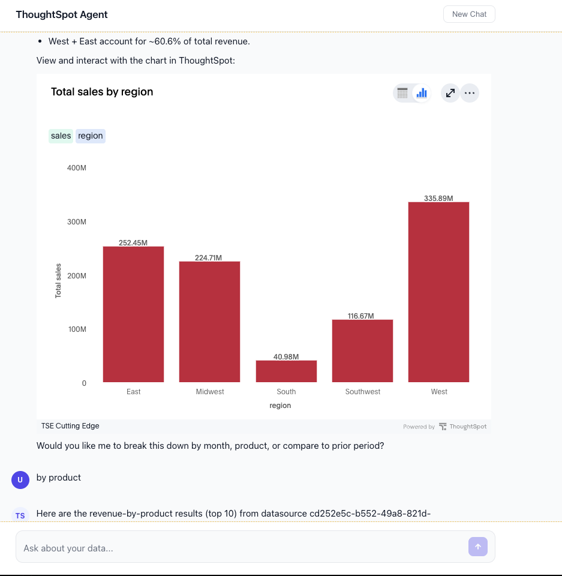

<!-- search-meta
tags: [MCP, Python, React, FastAPI, SSE, streaming, Anthropic, Claude, Spotter, ThoughtSpot-MCP, full-stack]
apis: [ThoughtSpotMCPServer, AnthropicAPI, ClaudeAPI, FastAPI, SSE, MCPClient, VisualEmbedSDK, startAutoMCPFrameRenderer]
questions:
  - How do I build a chat UI that connects to ThoughtSpot via MCP?
  - How do I stream ThoughtSpot MCP responses to a React frontend using SSE?
  - How do I build a full-stack ThoughtSpot AI chat application with Python and React?
  - How do I use Server-Sent Events with ThoughtSpot MCP in a FastAPI Python server?
  - How do I use Claude with ThoughtSpot MCP server?
  - How do I use client-side MCP tool calling with custom headers?
  - How do I render ThoughtSpot MCP charts with startAutoMCPFrameRenderer?
  - How do I poll get_session_updates for a ThoughtSpot analytical session?
  - How do I pin the ThoughtSpot MCP api-version?
  - How do I integrate the ThoughtSpot MCP server into my own application?
-->

# Python Agent with Simple React UI

A full-stack example that pairs a **Python (FastAPI) agent** with a **React chat UI**, running against the ThoughtSpot MCP server's **Spotter 3** toolset. Two backends are included:

| Backend                 | File                                                               | What it gives you                                          |
|-------------------------|--------------------------------------------------------------------|------------------------------------------------------------|
| **Spotter 3**           | `server/claude_agent_with_spotter3_mcp_server.py`                  | The agent, with history held in memory for the process life |
| **Spotter 3 + history** | `server/claude_agent_with_spotter3_mcp_server_and_chat_history.py` | The same, plus SQLite history you can list, reopen and delete |

Both use Anthropic Claude with a client-side MCP loop — the FastAPI process connects to the MCP server directly.

The backend streams responses to the frontend using Server-Sent Events (SSE), giving users a real-time chat experience while the agent queries ThoughtSpot for data insights and displays ThoughtSpot charts in an embed.

## Screenshot



---

## Claude + the Spotter 3 MCP Server

`claude_agent_with_spotter3_mcp_server.py` uses Anthropic's Claude API with a **client-side agentic loop** — the FastAPI process connects directly to the [ThoughtSpot MCP server](https://github.com/thoughtspot/mcp-server) using custom HTTP headers (`Authorization` + `x-ts-host`). This is required because Anthropic's server-side MCP connector cannot send custom headers.

### Architecture

```
┌──────────────┐   SSE stream   ┌──────────────────────┐   MCP (streamable-http)           ┌─────────────┐
│  React Chat  │ ◄────────────► │  FastAPI + Claude    │ ◄──────────────────────────────►  │ ThoughtSpot │
│  (Vite)      │   /api/chat    │                      │   Authorization + x-ts-host       │ MCP Server  │
└──────────────┘                └──────────────────────┘                                   └─────────────┘
     :8000                              :8001                                             agent.thoughtspot.app
```

**Request flow:**

1. User sends a message from the React UI
2. FastAPI borrows the shared MCP session to `agent.thoughtspot.app` - opening it with auth headers and fetching the tool list only on the first message, or when the session has to be replaced (see [Shared MCP session](#shared-mcp-session))
3. Claude receives the user message + ThoughtSpot tool definitions
4. Claude calls ThoughtSpot tools; FastAPI executes each call over the MCP session
5. For `get_session_updates`, FastAPI polls the Analytics Agent to completion itself (see below)
6. Text deltas, agent progress, and rendered answers stream to the UI over SSE in real time

### Integrating the ThoughtSpot MCP server into your own application

This example is meant to be copied from. The steps below are the path from "ThoughtSpot cluster" to "charts in my app's chat", each pointing at the code to lift.

#### 1. Prepare ThoughtSpot and Anthropic

- **A trusted-authentication secret key**, so your backend can mint tokens: *Develop > Customizations > Security Settings > Trusted authentication*. (A username + password also works for a demo, but MFA-enabled instances reject it.)
- **Your app's origin allowlisted for embedding.** The charts render in a ThoughtSpot iframe, and the cluster's CSP `frame-ancestors` must include the origin your UI is served from - otherwise the browser blocks the embed. This example's dev server is pinned to `http://localhost:8000` for exactly that reason (`client/vite.config.js`). See the [security settings docs](https://developers.thoughtspot.com/docs/security-settings) for CSP and CORS allowlists.
- **An Anthropic API key** for the agent.

#### 2. Mint ThoughtSpot tokens on your server

The secret key never reaches the browser. The backend calls `POST /api/rest/2.0/auth/token/full` and uses the result two ways:

- `server_token()` - a cached token for the agent's own MCP and REST calls. A background task (`keep_server_token_fresh()`) mints it at startup and renews it about 12 minutes before it expires, so no request waits on a mint - which can take tens of seconds on a loaded cluster.
- `GET /api/ts-token` - a **fresh** token per call for the browser's Visual Embed SDK. The SDK requires a new token from every `getAuthToken` call; handing it the same one twice triggers its "Duplicate token" alert once that token stops verifying.

Copy `mint_token()`, `server_token()` and the `/api/ts-token` endpoint.

> **Production:** this example mints every token for one service user (`TS_EMBED_USERNAME`). In your app, mint for the **authenticated end user** instead, so ThoughtSpot's own permissions and row-level security apply to every question they ask.

#### 3. Connect to the MCP server from your backend

- Endpoint: `https://agent.thoughtspot.app/token/mcp?api-version=...`, with headers `Authorization: Bearer <token>` and `x-ts-host: <your cluster>`.
- Connect **client-side** (your process holds the MCP session), because Anthropic's server-side MCP connector cannot send the custom `x-ts-host` header.
- **Pin `api-version`** to a release date for anything you depend on - see [MCP endpoint and API version](#mcp-endpoint-and-api-version).
- **Share one session across requests.** Opening a session took 6-11 s on the clusters this was tested against. `connect_mcp()`, `McpPool` and `McpTurn` open it once, reconnect when it breaks or the token rotates, and retry a failed handshake once.

#### 4. Hand the tools to your LLM

- Convert `list_tools()` to your model's tool format (`build_tools()`), run the tool loop (`agent_loop()`), and return all parallel tool results in one message.
- **Poll `get_session_updates` in your code, not in the model.** `send_session_message` returns immediately and the Analytics Agent answers asynchronously; `autopoll_session_updates()` polls to completion and gives the model one consolidated result.
- **Strip `iframe_url` from what the model sees** (`strip_rendered_answers()`) - your UI renders the chart, so the model only needs to summarize it.

#### 5. Stream progress and answers to your UI

Stream text, progress and answers as they arrive - an Analytics Agent answer typically takes tens of seconds. This example uses Server-Sent Events; the event contract is in [SSE events](#sse-events).

#### 6. Render the charts with the Visual Embed SDK

```ts
init({
  thoughtSpotHost: import.meta.env.VITE_TS_HOST,
  authType: AuthType.TrustedAuthTokenCookieless,
  getAuthToken: async () => {
    const response = await fetch("/api/ts-token", { cache: "no-store" });
    if (!response.ok) throw new Error(`Token request failed: ${response.status}`);
    return (await response.json()).token;
  },
  autoLogin: true, // fetch a replacement before the current token expires
});

// Upgrades every <iframe> whose src carries tsmcp=true into an authenticated embed.
// The renderer builds its own embeds: styling passed to init() does not reach them,
// so pass `customizations` here as well if you theme the embed.
startAutoMCPFrameRenderer({ frameParams: { height: "600px" } });
```

Then put an `<iframe src="{iframe_url}">` wherever an answer belongs - the renderer does the rest. See [Chart rendering](#chart-rendering-with-startautomcpframerenderer).

#### 7. (Optional) Persist chat history

Store the raw model messages, the `analytical_session_id`, and each answer's **title and position** - not its `iframe_url`, which expires with the ThoughtSpot answer (about 8 hours). On replay, the SDK resolves a current chart from the conversation id and the answer's index. See [Adding Chat History](#adding-chat-history).

#### 8. Production checklist

- [ ] Tokens minted per end user, not for a shared service user.
- [ ] Authentication on your own endpoints (`/api/chat`, `/api/ts-token`, `/api/conversations`) - this example has none.
- [ ] Chat history scoped to the user who owns it.
- [ ] `api-version` pinned to a release date.
- [ ] Model output sanitized before rendering. This example renders markdown with `rehypeRaw`, which passes raw HTML through: add `rehype-sanitize` with a schema that allows only `<iframe>` tags pointing at your ThoughtSpot host.
- [ ] Iframe `src` validated: accept only `https:` URLs on your ThoughtSpot host before building an embed.
- [ ] Conversation history pruned or compacted - replaying an unbounded history grows every request.
- [ ] A real database if you run more than one server process.

### Prerequisites

- Python 3.10+ (required by `anthropic` 1.x)
- Node.js 18+
- Anthropic API key
- ThoughtSpot instance with a host URL, and either trusted-authentication credentials (username + secret key) or a static bearer token. The server refuses to start with neither.

### Environment Setup

From the project root (`python-react-agent-simple-ui/`):

```bash
cp env.template .env
```

Edit `.env` — the agent uses these variables:

```env
# Server-side — used by the Claude agent
ANTHROPIC_API_KEY=your_anthropic_api_key_here

# ThoughtSpot host (VITE_ prefix makes it available to the React client too)
VITE_TS_HOST=your-instance.thoughtspot.cloud

# Token minting - recommended. The server mints short-lived tokens for itself and
# for the browser; the secret never leaves the server.
TS_EMBED_USERNAME=the_thoughtspot_username_to_embed_as
TS_SECRET_KEY=your_trusted_auth_secret_key      # or TS_EMBED_PASSWORD=...
# TS_TOKEN_VALIDITY_SEC=1800                    # browser token lifetime
# TS_SERVER_TOKEN_VALIDITY_SEC=3600             # the server's own token lifetime

# Required only when no minting credentials are set - demo only
# VITE_TS_AUTH_TOKEN=your_thoughtspot_bearer_token

# Optional overrides
# ANTHROPIC_MODEL=claude-haiku-4-5
# TS_MCP_API_VERSION=2026-05-01
# TS_MCP_URL=https://agent.thoughtspot.app/token/mcp?api-version=2026-05-01
```

> **Note:** `VITE_TS_HOST` / `VITE_TS_AUTH_TOKEN` are read by both the Python server and the React client. You can also set them without the `VITE_` prefix as `TS_HOST` / `TS_AUTH_TOKEN` if you only need server-side access.

> **Warning:** With no minting credentials set, `/api/ts-token` serves the static `VITE_TS_AUTH_TOKEN`. That is for development only: the embed cannot recover once the token expires. For production, use [Trusted Authentication](https://developers.thoughtspot.com/docs/trusted-auth) and mint a token per end user.

### Running the agent

**Backend:**

```bash
cd server
python -m venv .venv
source .venv/bin/activate   # Windows: .venv\Scripts\activate
pip install -r requirements.txt
uvicorn claude_agent_with_spotter3_mcp_server:app --reload --port 8001
```

**Frontend** (separate terminal):

```bash
cd client
npm install
npm run dev
```

Open `http://localhost:8000`. The Vite dev server proxies `/api` to the FastAPI backend on port 8001. The frontend port is fixed (`strictPort`) because it is the origin allowlisted in the cluster's CSP `frame-ancestors`; serving the UI anywhere else makes the browser block the chart embeds.

Sanity check the MCP connection without the model:

```bash
curl -s http://localhost:8001/api/tools | python -m json.tool
```

To see where a turn's time goes, the chat-history server logs `[Timing]` lines: MCP session, each model call, each tool call, and the turn total.

### How it Works

#### MCP endpoint and API version

```
https://agent.thoughtspot.app/token/mcp?api-version=latest
```

The MCP server exposes several endpoint families and versions its toolset:

| Path | Auth | Toolset |
|------|------|---------|
| `/token/mcp` | Static bearer token + `x-ts-host` | Version-negotiated via `api-version` |
| `/bearer/mcp` | Static bearer token (legacy) | Frozen on the older, pre-Spotter 3 toolset (`getAnswer`, `getRelevantQuestions`, …) |
| `/mcp` | OAuth | Version-negotiated |

`api-version` accepts `latest`, `beta`, or a release date. This example defaults to `latest`, which always gets the newest toolset — convenient, but it means a ThoughtSpot release can change the tools and the update shape underneath you. **For anything you depend on, pin a release date** via `TS_MCP_API_VERSION`: a pinned date does not move, so your prompt and your tool-handling code stay in sync. `2026-05-01` is the first release of the Spotter 3 (analytical session) toolset.

`list_orgs` / `switch_org` are OAuth-only — the server hides them on `/token/*`, so they never appear in the tool list for this static-token setup.

#### Server-side polling of `get_session_updates`

The ThoughtSpot Analytics Agent answers asynchronously: `send_session_message` returns immediately, and `get_session_updates` must be polled until `is_done: true`. Letting the *model* poll costs a full Claude round-trip per poll, and the first few polls usually return nothing at all.

Instead `autopoll_session_updates()` does it in-process: it polls with backoff until the Agent is done, accumulates every update, and hands Claude **one** consolidated tool result. Progress streams to the UI as `status` events while it waits - the Agent's steps ("Searching for Datasets", ...), not its reasoning prose, which arrives in word-sized chunks. The model still receives the full reasoning in the tool result.

```python
POLL_INITIAL_DELAY = 0.75   # seconds before the first re-poll
POLL_MAX_DELAY = 4.0        # backoff cap; resets whenever new updates arrive
POLL_TIMEOUT = 300.0        # give up and tell the model what did arrive
```

#### Shared MCP session

Opening an MCP session costs several round trips (a discovery probe, `initialize`, `tools/list`) - 6-11 s on the clusters this was tested against. So one session is shared by every chat turn:

- `McpPool` holds it open in a background task. A turn borrows it through `McpTurn` and gives it back when the turn ends.
- It is replaced when the server token rotates (the old session stays open until the turns using it finish), or when it breaks.
- A tool call that finds the session dropped (`MCPError` -32600 with the message `"Session terminated"`) is repeated once on a fresh session - the server rejected it without running it, so repeating it is safe. The code checks the message as well as the code: the MCP client also raises -32600 in cases where the call may already have been processed. Any other connection error marks the session for replacement and is reported, without a retry.
- A session replaced mid-turn stays open until that turn ends, so a parallel tool call still running on it is not cut off.
- A failed handshake is retried once with a freshly minted token (`connect_mcp()`), because `initialize` intermittently returns a bare HTTP 500.

#### Answers are rendered by the client, not the model

Each `answer` update carries an `iframe_url` with a `tsmcp=true` marker. The server streams it to the browser as an `answer` SSE event; `App.tsx` mounts a bare `<iframe>` and the Visual Embed SDK's `startAutoMCPFrameRenderer` replaces it in place with a fully configured, authenticated ThoughtSpot embed.

Because the UI already draws the chart, the server **strips `iframe_url` out of the tool result Claude sees** and marks the update `rendered_in_ui: true`. That removes a long URL per answer from the context and stops the model from re-emitting markup for a chart that is already on screen.

#### Conversation and session continuity

```
conversations:        { conv_id → [user msg, assistant msg + tool calls, tool results, ...] }
analytical_sessions:  { conv_id → analytical_session_id }
```

Full message history (tool interactions included) is kept in memory per `conv_id`. Each `/api/chat` request either starts a new conversation or continues one via the `response_id` returned in the previous `done` event. When Claude calls `create_analysis_session`, the returned `analytical_session_id` is stored and injected into the system prompt on later turns so follow-ups stay in the same ThoughtSpot session.

#### Agentic loop

`agent_loop()` runs until `stop_reason != "tool_use"`:

1. Stream from `claude_client.beta.messages.stream(...)` with the MCP tool definitions
2. Emit `delta` (text) and `status` (thinking / tool start) SSE events
3. On `tool_use`: execute every tool call **concurrently** with `asyncio.gather`, auto-polling `get_session_updates`
4. Append the assistant turn + **all** `tool_result` blocks in a single user message
5. Repeat

Other Claude API details worth noting:

- **Model:** `claude-haiku-4-5` by default. The agent only orchestrates ThoughtSpot's tools - the Analytics Agent does the analysis - so the fastest model fits. Measured on one question, the four model calls in a turn took ~4 s in total on Haiku 4.5, ~8 s on Opus 5 and ~17 s on Sonnet 5 (single runs; the Analytics Agent's own 40-100 s dominates either way). Haiku 4.5 runs without thinking, since it has no adaptive thinking; Sonnet 5 and Opus 5 use adaptive thinking (`{"type": "adaptive", "display": "summarized"}`).
- **Prompt caching:** `cache_control` on the last tool definition and on the system prompt. Tools and system prompt are byte-identical on every turn, so they sit at the front of the cacheable prefix. On Haiku 4.5 the cache does not engage: the prefix (~3.6K tokens) is under its 4,096-token minimum. Sonnet 5 and Opus 5 cache it.
- **Refusal fallbacks:** on `claude-opus-5` and `claude-fable-5-1` (`FALLBACK_CAPABLE_MODELS`), the `server-side-fallback-2026-07-01` beta with `fallbacks="default"` re-routes a declined request to a fallback model. Sonnet 5 and Haiku 4.5 have no fallback targets, so the beta is not sent for them. `stop_reason == "refusal"` is handled explicitly on every model.
- **Parallel tool results** go back in one user message — splitting them teaches the model to stop making parallel calls.

#### SSE events

| Event | Fields | Meaning |
|-------|--------|---------|
| `delta` | `text` | Streamed assistant text |
| `status` | `message` | Thinking, tool start, Analytics Agent step, or reconnecting |
| `answer` | `answer_id`, `title`, `query`, `iframe_url`, `frame_params` | A chart to render. `frame_params` carries the embed ids when there is no ready-made `iframe_url` |
| `done` | `response_id` | Turn complete; pass `response_id` back for follow-ups |
| `error` | `message` | Fatal error for this turn |

### Customization

#### Change the Claude model

Set `ANTHROPIC_MODEL` in `.env`, or edit the constant:

```python
MODEL = os.getenv("ANTHROPIC_MODEL", "claude-haiku-4-5")
```

`model_request_options()` picks the thinking and fallback options each model accepts, so switching between `claude-haiku-4-5`, `claude-sonnet-5` and `claude-opus-5` needs no other change. Choose Sonnet 5 if follow-up questions need stronger reasoning than Haiku gives.

#### System prompt

Edit `SYSTEM_PROMPT` to change tone, focus, or datasource:

```python
# Uncomment to force one datasource for every question in this app:
# SYSTEM_PROMPT += "\nUse this datasource for all data questions: cd252e5c-b552-49a8-821d-3eadaa049cca."
```

#### Restrict available tools

`ALLOWED_TOOLS = None` (the default) passes through whatever the server exposes, which is usually right — the tool list is version-negotiated, so a hardcoded list silently drops tools added in later API versions. Set it to a list of names to restrict the agent:

```python
ALLOWED_TOOLS = ["create_analysis_session", "send_session_message", "get_session_updates"]
```

#### Available ThoughtSpot MCP tools (Spotter 3 toolset)

| Tool | Inputs | Outputs | Description |
|------|--------|---------|-------------|
| `check_connectivity` | — | `success` | Test connectivity and authentication. Call this if other tools are failing. |
| `search_objects` | `query`, optional `types`, `owner`, `tag`, `modified_since`, `verified_only`, `limit`, `cursor` | `results`, `next_cursor`, `status` | Find existing Liveboards, Answers, Liveboard vizzes and Worksheets by name. Returns identifiers and metadata only — never data, and it runs no queries. |
| `create_analysis_session` | `data_source_id` _(optional)_ | `analytical_session_id` | Start an analytical session. Omit `data_source_id` to let the Analytics Agent pick a source. Sessions are conversational — reuse one for follow-ups. |
| `send_session_message` | `analytical_session_id`, `message`, `additional_context` _(optional)_ | `success` | Ask a natural-language question. The answer is not returned here — it arrives via `get_session_updates`. Use `additional_context` for background the Agent could not know (e.g. "fiscal year starts in April"). |
| `get_session_updates` | `analytical_session_id` | `session_updates` (list), `is_done` | Incremental updates from the session. **This server polls it to completion for you** and returns one consolidated result. |
| `create_dashboard` | `title`, `answers` (list of `{answer_id, title}`), `note_tile` | `link` | Create a dashboard from answers. `note_tile` is raw single-line HTML. Returns a URL. |
| `list_orgs` / `switch_org` | — / `org_id` | `orgs` / `success`, `active_org_id` | OAuth-only; not exposed on the `/token/*` endpoint this example uses. |

**`session_update` fields** (items in `session_updates`):

| Field | Present when | Description |
|-------|--------------|-------------|
| `type` | always | `text`, `text_chunk`, `answer`, or `step_notification` |
| `is_thinking` | always | Whether this update is part of the Agent's reasoning rather than its final answer. The server shows reasoning *steps* in the UI as status text, and passes the reasoning prose to the model only. |
| `text` | `text`, `text_chunk`, `step_notification` | Message text. Consecutive `text_chunk` values are concatenated by the server before the model sees them. |
| `answer_id` | `answer` | Identifier to pass to `create_dashboard`. |
| `answer_title` | `answer` | Human-readable title. |
| `answer_data_source_id` | `answer` | Data source the answer was built on. |
| `answer_query` | `answer` | The search query the Agent used. |
| `iframe_url` | `answer` | Embeddable URL. Streamed to the browser; **stripped from the model's tool result** since the UI renders it. |

---

## Adding Chat History

`claude_agent_with_spotter3_mcp_server_and_chat_history.py` is the same agent plus a persistent chat history, so conversations survive a restart and the UI can list, reopen and delete them. Run it instead of `claude_agent_with_spotter3_mcp_server`:

```bash
uvicorn claude_agent_with_spotter3_mcp_server_and_chat_history:app --reload --port 8001
```

The React client works against both backends — it probes `/api/conversations` on load and renders the history sidebar only if that endpoint exists.

### Why the app owns chat history

The ThoughtSpot MCP server has its own conversation storage (`ConversationStorageServerSQLite`), but that is internal plumbing for `get_session_updates` delivery — read/write bookmarks and a short TTL, not a client-facing history API. An `analytical_session_id` also expires after prolonged inactivity. So chat history belongs to your app.

### Storage

SQLite through the Python stdlib — no extra dependency. Path defaults to `server/chat_history.db`, overridable with `CHAT_HISTORY_DB`. Writes run in a worker thread (`asyncio.to_thread`) so they never block the event loop, and the DB is opened in WAL mode so reads work while a turn is being written.

Two tables, because the browser and the model need different things:

| Table | Column | Purpose |
|-------|--------|---------|
| `conversations` | `id`, `title`, `created_at`, `updated_at` | The sidebar list. `title` is the first line of the first user message. |
| | `analytical_session_id` | The ThoughtSpot session, so a reopened conversation continues in the same one. |
| | `claude_messages` | The **raw** Claude message list — `tool_use` / `tool_result` / `thinking` blocks included — replayed into the next request so follow-ups keep full context after a restart. |
| `turns` | `role`, `content`, `answers` | What the UI renders. `answers` holds each chart's title and query - **not** its `iframe_url`, which expires with the ThoughtSpot answer (about 8 hours). |

`turns` cascades on delete (`PRAGMA foreign_keys=ON`), so removing a conversation removes its transcript.

### Replaying charts

A reopened chat re-runs its charts against current data. `GET /api/conversations/{id}` gives every stored answer an `answer_index` - its position in the conversation - and the client builds an embed URL from `tsmcpConversationId` (the `analytical_session_id`) plus `tsmcpAnswerIndex`. The SDK resolves that to a live answer.

The index must count the way ThoughtSpot counts, so `reconcile_answers()` asks ThoughtSpot how many answers each turn holds (`/api/rest/2.0/ai/agent/conversations/{id}/messages`) and aligns the stored titles to it. That call is why opening a stored chat takes a few seconds; the UI shows a loading indicator meanwhile.

`jsonable()` serializes the Claude history with `model_dump(mode="json")` rather than by hand. That matters for thinking blocks: their `signature` must come back **unchanged** on replay, and a hand-rolled `{"type", "text"}` mapping would drop it.

### What gets written when

```
POST /api/chat  →  create conversation row (first turn only)
                →  insert user turn
                →  run the agent loop, recording every SSE event
   done / error →  insert assistant turn (text + answers)
                →  save claude_messages + analytical_session_id
```

`StreamRecorder` fans each SSE event out to both the browser and the transcript, so a reopened conversation renders from exactly the events the live one received. The assistant turn is written on the error paths too — the user turn is already stored, and skipping it would leave a question with no visible answer.

In-memory `conversations` / `analytical_sessions` dicts stay as a hot cache in front of SQLite; a miss (after a restart, say) falls back to the stored state.

### Endpoints

| Method | Path | Purpose |
|--------|------|---------|
| `GET` | `/api/conversations` | List conversations, newest first. Returns `id`, `title`, timestamps, `turn_count`. |
| `GET` | `/api/conversations/{id}` | One conversation with its `turns` (each `role`, `content`, `answers` with `answer_index`). |
| `PATCH` | `/api/conversations/{id}` | Rename. Body: `{"title": "..."}`. |
| `DELETE` | `/api/conversations/{id}` | Delete the conversation and its turns. |
| `GET` | `/api/ts-token` | A freshly minted ThoughtSpot token for the Visual Embed SDK (both servers). |
| `GET` | `/api/tools` | Debug: the MCP tool list for the current token and API version (both servers). |

### Limits of this example

- **No auth and no per-user scoping.** Every conversation in the file is visible to every caller. Add a user id column and filter on the authenticated user before this goes anywhere real.
- **No pruning.** `claude_messages` grows with every turn. For long-lived chats, add [context editing or compaction](https://docs.anthropic.com) rather than replaying an unbounded history.
- **Single process.** SQLite in WAL mode is fine for one uvicorn worker; use a real database if you run several.

## Project Structure

```
python-react-agent-simple-ui/
├── .env                                                           # Shared env vars (create from env.template)
├── env.template                                                   # Environment variable template
├── server/
│   ├── claude_agent_with_spotter3_mcp_server.py                   # FastAPI + Claude API + client-side MCP
│   ├── claude_agent_with_spotter3_mcp_server_and_chat_history.py  # the same, plus SQLite chat history
│   ├── chat_history.db                                            # created on first run (gitignored)
│   └── requirements.txt                                           # Python dependencies
├── client/
│   ├── package.json                                               # Node dependencies; `npm run typecheck`
│   ├── tsconfig.json                                              # TypeScript config (type-check only; Vite builds)
│   ├── vite.config.js                                             # Vite config with API proxy + envDir
│   ├── index.html                                                 # HTML entry point
│   └── src/
│       ├── main.tsx                                               # React entry point
│       ├── App.tsx                                                # Chat UI component
│       ├── App.css                                                # Styles
│       └── vite-env.d.ts                                          # Types for import.meta.env
└── README.md
```

---

## Frontend (`client/src/App.tsx`)

The React client is shared across both backends:

- Reads the SSE stream with `fetch` + the `ReadableStream` API
- Renders assistant text as **markdown** (tables, code blocks, and raw HTML via `rehypeRaw`)
- Renders ThoughtSpot charts from `answer` events as auto-upgraded embeds
- Shows **real-time status** — Claude thinking, tool calls, and Analytics Agent progress
- Tracks `response_id` across turns for multi-turn continuity
- Shows a **chat history sidebar** when the backend exposes `/api/conversations` — click to reopen a chat (charts and all), `×` to delete. A loading indicator shows while a stored chat is fetched. Against the backend without history the probe fails and the sidebar is simply not rendered.

### Chart rendering with `startAutoMCPFrameRenderer`

Every `iframe_url` the MCP server returns carries a `tsmcp=true` query parameter. `startAutoMCPFrameRenderer` puts a `MutationObserver` on `document.body`, finds any iframe with that marker, and replaces it in place with a fully configured ThoughtSpot embed — merging the SDK's embed params (auth, styling, host) with the ones already on the URL. For a live answer the app just passes the `iframe_url` through; it builds an embed URL itself only when an answer arrives without one (see `answerSrc()` below).

```javascript
import { startAutoMCPFrameRenderer } from "@thoughtspot/visual-embed-sdk";

// After init(). Returns the observer — call observer.disconnect() to stop watching.
startAutoMCPFrameRenderer({
  frameParams: { height: "600px" },
});
```

This works for both paths into the DOM: charts the server streams as `answer` events, and any `<iframe>` the model writes into its markdown.

The client injects each answer's iframe as markup rather than rendering `<iframe>` as JSX. The renderer swaps the element with `replaceWith()`, so React must not own that node - React owns only the wrapper:

```tsx
<div dangerouslySetInnerHTML={{ __html: answerHtml(answer, sessionId) }} />
```

`answerHtml()` builds the `<iframe>` from `answerSrc()`: the live `iframe_url` when there is one, else an embed route from `frame_params`, else - for a stored answer - `tsmcpConversationId` plus `tsmcpAnswerIndex`.

### Visual embed customization

ThoughtSpot embed styling is configured at the top of `client/src/App.tsx`. The same `customizations` must go to both `init()` and `startAutoMCPFrameRenderer()` - the renderer builds its own embeds, so styling passed only to `init()` does not reach the charts. `App.tsx` does this with a shared `embedTheme` object (a dark palette when the system theme is dark). `getAuthToken` fetches a fresh token from `/api/ts-token` on every call (see [step 2](#2-mint-thoughtspot-tokens-on-your-server)):

```ts
init({
  thoughtSpotHost: import.meta.env.VITE_TS_HOST,
  authType: AuthType.TrustedAuthTokenCookieless,
  getAuthToken: async () => {
    const response = await fetch("/api/ts-token", { cache: "no-store" });
    if (!response.ok) throw new Error(`Token request failed: ${response.status}`);
    return (await response.json()).token;
  },
  autoLogin: true,
  customizations: {
    style: {
      customCSS: {
        variables: {
          "--ts-var-button-border-radius": "10px",
          "--ts-var-button--secondary-background": "#FDE9AF",
          "--ts-var-button--secondary--hover-background": "#FCD977",
          "--ts-var-menu-background": "#FDE9AF",
          // Full list of variables: https://developers.thoughtspot.com/docs/custom-css
        },
      },
    },
  },
});
```

---

## Troubleshooting

| Issue                                     | Fix                                                                    |
|-------------------------------------------|------------------------------------------------------------------------|
| `ANTHROPIC_API_KEY` errors                | Ensure `.env` in the project root contains a valid Anthropic API key   |
| ThoughtSpot auth errors                   | Verify `VITE_TS_HOST`, and `TS_EMBED_USERNAME` + `TS_SECRET_KEY` (or `VITE_TS_AUTH_TOKEN` when not minting). The server log prints the cluster's reason, e.g. `Service Secret code is not valid` |
| "Duplicate token" alert in the embed      | The browser is getting the same token twice - set the minting variables so `/api/ts-token` mints a fresh one per call |
| MCP connection failures                   | `curl localhost:8001/api/tools` — if that fails, the token or `VITE_TS_HOST` is wrong |
| `MCPError: Server returned an error response` | The MCP server's `initialize` returned HTTP 500. It is retried once automatically; if it persists, the MCP service or cluster is having trouble |
| Tool calls fail with `Failed to validate connection` | The cluster no longer accepts the token. The server renews its token before expiry; restart it if the error persists |
| Charts blocked / blank iframe             | The UI's origin is not in the cluster's CSP `frame-ancestors`. Serve the UI from the allowlisted origin (`http://localhost:8000` here) |
| Only legacy tools (`getAnswer`, …) appear | You are on a `/bearer/*` URL; use `/token/mcp?api-version=2026-05-01`  |
| `list_orgs` / `switch_org` missing        | Expected — they are OAuth-only and hidden on `/token/*`                |
| `ImportError: streamable_http_client`     | Old `mcp` package; `pip install -r requirements.txt` (needs `mcp>=2.1.1`) |
| Charts never appear                       | Check the browser console for the Visual Embed SDK, and that `npm install` picked up `@thoughtspot/visual-embed-sdk@^1.52.1` |
| Answers render twice                      | The model emitted its own `<iframe>` too — reinforce that rule in `SYSTEM_PROMPT` |
| History sidebar missing                   | You are running `claude_agent_with_spotter3_mcp_server`; run `claude_agent_with_spotter3_mcp_server_and_chat_history` for history |
| History empty after restart               | `CHAT_HISTORY_DB` points somewhere new, or the process cannot write to `server/` |
| CORS errors in browser                    | Ensure FastAPI server is running on port 8001                          |
| Blank responses                           | Check FastAPI logs for streaming or MCP errors                         |
| Follow-up questions lose context          | Ensure `response_id` is passed back in subsequent `/api/chat` requests |

---

## Learn More

- [Anthropic Claude API](https://docs.anthropic.com)
- [Model Context Protocol](https://modelcontextprotocol.io)
- [ThoughtSpot MCP Server](https://github.com/thoughtspot/mcp-server)
- [ThoughtSpot Visual Embed SDK](https://developers.thoughtspot.com/docs/visual-embed-sdk)
- [ThoughtSpot Developer Docs](https://developers.thoughtspot.com)
- [ThoughtSpot Trusted Auth](https://developers.thoughtspot.com/docs/trusted-auth)
