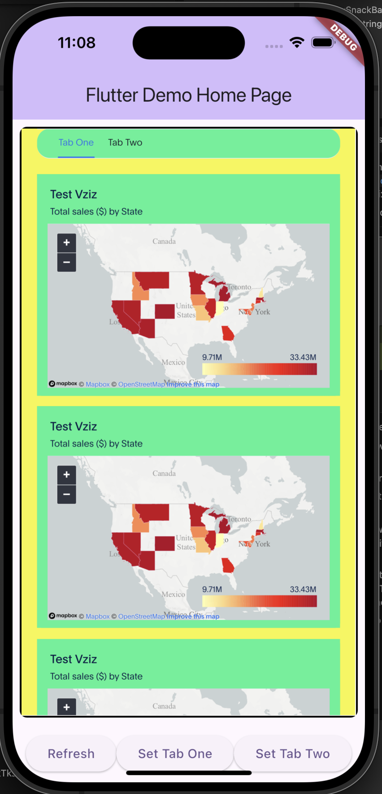

# ThoughtSpot Flutter Embed Example

> This example uses the [ThoughtSpot Flutter Embed SDK](https://pub.dev/packages/flutter_embed_sdk) to integrate ThoughtSpot analytics into Flutter applications.

## Preview



This example demonstrates how to embed a ThoughtSpot Liveboard using the **Flutter Embed SDK** in a Flutter application. It covers **authentication**, **custom theming**, and interaction using **host and embed events**.

## Features

### Custom Styles using CSS Variables

Demonstrates how to customize ThoughtSpot UI using **custom CSS variables**:

```dart
customCSS: customCssInterface(
  variables: {
    "--ts-var-root-background": "#f6f641",
    "--ts-var-root-color": "#041a45",
    "--ts-var-viz-background": "#38f193",
    "--ts-var-viz-border-radius": "20px",
  },
),
```

### Host Events using trigger()

Programmatically control the embedded Liveboard by sending host events to it:

```dart
// Reload the Liveboard
liveboardEmbedController.trigger(HostEvent.Reload);

// Switch to a specific tab
liveboardEmbedController.trigger(HostEvent.SetActiveTab, {
  'tabId': ThoughtSpotConst.tabId,
});
```

### Embed Events using on()

Listen for events emitted by the embedded content and handle them:

```dart
liveboardEmbedController.on(EmbedEvent.Data, (payload) {
  print('Data event received: ${payload['displayMode']}');
});
```

## Code Structure

- `main.dart`: Main app file with ThoughtSpot embedding logic
- `pubspec.yaml`: Project dependencies and metadata

## How to Use

1. Clone or copy this project.

2. Update ThoughtSpot details in `main.dart`:

```dart
static const String host = 'https://<your-thoughtspot-host>';
static const String username = '<your-username>';
static const String password = '<your-password>';
static const String liveboardId = '<your-liveboard-id>';
static const String tabIdOne = '<your-tab-id>';
static const String tabIdTwo = '<your-tab-id>';
```

3. Install dependencies:

```bash
flutter pub get
```

4. Run the app:

```bash
flutter run
```

## Documentation

- [Flutter Embed SDK Documentation](https://developers.thoughtspot.com/docs/embed-ts-flutter)

## Technology Stack

- Flutter
- Dart
- Mobile/Web
