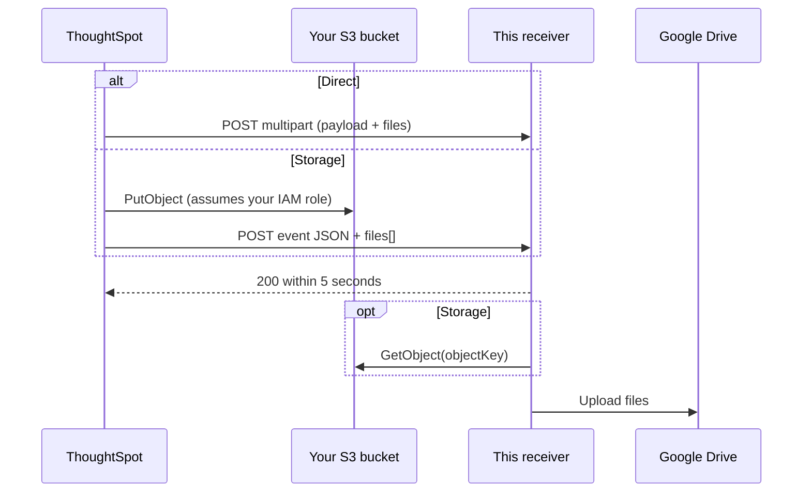

<!-- search-meta
tags: [webhooks, Liveboard-schedule, REST-API, AWS-S3, Google-Drive, TypeScript, NodeJS, Express, rest-api-sdk]
apis: [createWebhookConfiguration, getWebhookStorageConfig, configureCommunicationChannelPreferences, validateCommunicationChannel, LIVEBOARD_SCHEDULE, REST-API-v2]
questions:
  - How do I receive a scheduled ThoughtSpot Liveboard through a webhook?
  - How do I handle ThoughtSpot webhook deliveries with PDF/CSV/XLSX attachments in Node.js?
  - How do I deliver Liveboard schedule files to an AWS S3 bucket with ThoughtSpot webhooks?
  - How do I upload ThoughtSpot scheduled Liveboard exports to Google Drive?
  - How do I route Liveboard schedules to the webhook communication channel?
-->

# Liveboard schedule webhook (Typescript)

A webhook receiver, built with TypeScript and Express, for ThoughtSpot **Liveboard schedule** events. When a scheduled Liveboard runs, ThoughtSpot exports it (PDF, CSV or XLSX) and delivers it to this receiver, which uploads the files to a Google Drive folder.

ThoughtSpot delivers in one of two ways, depending on whether the webhook has a storage destination:

| | Direct (no storage destination) | Storage (S3 destination) |
|---|---|---|
| Files | Inside the request | Written to your S3 bucket by ThoughtSpot |
| Request | `multipart/form-data`: a `payload` part with the event JSON, one `file` part per attachment | The event JSON plus a `files[]` list with each file's `objectKey` |
| Receiver needs | Nothing extra | Its own `s3:GetObject` access to the bucket |



## Key Usage

Simplified from [`src/main.ts`](src/main.ts):

```typescript
app.post('/webhooks/thoughtspot', checkBearerToken, express.json(), async (req, res) => {
  // Direct: event from the "payload" part, attachments from the "file" parts.
  // Storage: event is the JSON body; files[] says where each file is in S3.
  const { event, files } = await parseDelivery(req);

  // ThoughtSpot retries deliveries that fail or take longer than 5 seconds,
  // so skip repeats (data.msgUniqueId) and acknowledge before uploading.
  const key = event.data.msgUniqueId ?? event.eventId;
  if (seen.has(key)) return reply(res, 200, 'Duplicate delivery; already received');
  seen.add(key);
  reply(res, 200, 'Webhook received successfully');

  queue = queue.then(() => processDelivery(event, files)); // fetch from S3, upload to Drive
});
```

File structure:

```
liveboard-schedule-webhook
├── src
│   ├── main.ts        # The receiver: parse, acknowledge, fetch from S3, upload to Drive
│   ├── setup.ts       # ThoughtSpot-side setup with @thoughtspot/rest-api-sdk
│   └── demo.ts        # npm run dev / npm test: sends sample deliveries to the receiver
├── fixtures           # Sample deliveries from the payload documentation
├── .env.example
├── .stackblitzrc
└── package.json
```

## Demo

Open in [StackBlitz](https://stackblitz.com/github/thoughtspot/developer-examples/tree/main/rest-api/liveboard-schedule-webhook)

`npm run dev` needs no ThoughtSpot instance or cloud credentials. It sends the receiver three deliveries: a direct one, a storage one (one file stored, one failed), and a retry of the first. The files are written to `out/` instead of Drive.

## Documentation

- [Webhooks overview](https://developers.thoughtspot.com/docs/webhooks-overview)
- [Webhook for Liveboard schedule events](https://developers.thoughtspot.com/docs/webhooks-lb-schedule)
- [Webhook communication channel](https://developers.thoughtspot.com/docs/webhooks-comm-channel)
- [Webhook payload](https://developers.thoughtspot.com/docs/webhooks-lb-payload)
- [AWS S3 storage for webhooks](https://developers.thoughtspot.com/docs/webhooks-s3-integration)
- [REST API playground: create webhook](https://try-everywhere.thoughtspot.cloud/v2/#/everywhere/api/rest/playgroundV2_0?apiResourceId=http%2Fapi-endpoints%2Fwebhooks%2Fcreate-webhook-configuration)

## Run locally

- Clone the repository

```bash
git clone https://github.com/thoughtspot/developer-examples.git
cd developer-examples/rest-api/liveboard-schedule-webhook
```

- Install dependencies (Node 22 or later) and try the demo

```bash
npm install
npm run dev
```

- Copy `.env.example` to `.env` and set the variables:

| Variable | Description |
| --- | --- |
| `RECEIVER_TOKEN` | Bearer token ThoughtSpot sends to the receiver; the receiver rejects other requests |
| `DRIVE_FOLDER_ID` | Drive folder to upload to. It must be in a shared drive, with the service account as a member. Leave empty to write to `out/` |
| `GOOGLE_APPLICATION_CREDENTIALS` | Service-account key file for Drive |
| `TS_HOST`, `TS_TOKEN` | Your ThoughtSpot instance, and a bearer token for the setup calls |
| `WEBHOOK_URL` | Where ThoughtSpot can reach the receiver (HTTPS) |
| `S3_BUCKET`, `S3_REGION`, `S3_ROLE_ARN`, `S3_EXTERNAL_ID`, `S3_PATH_PREFIX` | Optional S3 storage destination |

- Start the receiver and make it reachable from your ThoughtSpot instance, for example with [ngrok](https://ngrok.com/) or by deploying it. For storage mode, it also needs AWS credentials with `s3:GetObject` on the bucket.

```bash
npm start
```

- Set up ThoughtSpot, in this order:

| Step | Command | API |
| --- | --- | --- |
| 1. S3 only: get ThoughtSpot's AWS account or GCP service account and a trust-policy template | `npm run setup -- storage-config` | `GET /api/rest/2.0/webhooks/storage-config` |
| 2. S3 only: create the bucket and an IAM role with that trust policy, allowed `s3:PutObject` and `s3:PutObjectAcl` | AWS console | [S3 storage docs](https://developers.thoughtspot.com/docs/webhooks-s3-integration) |
| 3. Create the webhook | `npm run setup -- create-webhook` | `POST /api/rest/2.0/webhooks/create` |
| 4. Send Liveboard schedules to it. Until then, they keep going to email | `npm run setup -- route-schedules` | `POST /api/rest/2.0/system/preferences/communication-channels/configure` |
| 5. Send a test delivery (set `WEBHOOK_ID` to the id from step 3) | `npm run setup -- validate` | `POST /api/rest/2.0/system/communication-channels/validate` |
| 6. Schedule a Liveboard | Liveboard **Schedule** menu | |

  For step 2, how the trust policy works depends on where your cluster is hosted:
  - **AWS-hosted clusters:** it uses an external ID (case-sensitive), passed as `S3_EXTERNAL_ID`.
  - **GCP-hosted clusters:** register `accounts.google.com` as an identity provider, and condition the trust on `accounts.google.com:sub` and `:aud`.

### Before you start

- Webhooks are Beta. ThoughtSpot Support enables them, together with the COMS mail agent and template-variable service they need. Without those, schedules fail with `WEBHOOK_PREREQUISITE_NOT_MET`.
- Only Liveboard schedule events use the webhook channel today, and only one Liveboard schedule webhook is allowed per Org.
- Minimum versions:
  - 10.14.0.cl: webhook APIs;
  - 26.3.0.cl: S3 storage;
  - 26.4.0.cl: `validate`;
  - 26.7.0.cl: `storage-config`.
- Privileges: `ADMINISTRATION` or `DEVELOPER` (with RBAC, `CAN_MANAGE_WEBHOOKS` also works). Cluster-wide channel preferences need `ADMINISTRATION`.

### Not covered

These can be added on top of `src/main.ts`:
- GCS storage destinations;
- signature verification: the docs don't specify what is signed or how;
- a durable queue and shared dedupe store, needed for more than one receiver instance.

## Technology labels

- Typescript
- NodeJS
- Express
- REST API SDK
- AWS S3
- Google Drive
- Webhook
