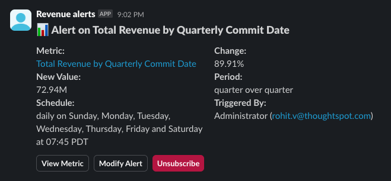

<!-- search-meta
tags: [KPI-monitor, webhook, Slack, Python, FastAPI, alerts, notifications]
apis: [KPIMonitorWebhookPayload, SlackWebhookAPI, FastAPI, notificationType, scheduledMetricUpdateWebhookNotification]
questions:
  - How do I send ThoughtSpot KPI monitor alerts to Slack using Python?
  - How do I build a Python FastAPI webhook for ThoughtSpot KPI alerts?
  - How do I handle ThoughtSpot KPI webhook payloads in Python?
  - How do I integrate ThoughtSpot KPI monitor with Slack using FastAPI?
  - How do I filter ThoughtSpot webhook notification types in Python?
  - How do I send a rich Slack block kit message from a ThoughtSpot KPI alert?
-->

# Slack webhook (Python)

A webhook built with Python and FastAPI that forwards ThoughtSpot KPI monitor alerts to a Slack channel as a rich block kit message. The message would look like this:



This app exposes a single endpoint `/send-to-slack` that accepts POST requests from KPI Monitor. It filters by notification type, extracts metric details from the payload, and sends a formatted Slack message with metric info and action buttons.

## Key Usage

```python
from fastapi import FastAPI, HTTPException
from slack_sdk import WebClient
from pydantic import BaseModel
from typing import Dict, Any
import os

app = FastAPI()
slack_client = WebClient(token=os.getenv("SLACK_TOKEN"))
slack_channel = os.getenv("SLACK_CHANNEL")

# Only forward real alert updates — ignore subscription/test events
UPDATION_NOTIFICATION_TYPES = {
    "SCHEDULE_METRIC_UPDATE",
    "THRESHOLD_METRIC_UPDATE",
    "AUTOMATIC_SELF_SUBSCRIPTION",
    "THRESHOLD_BY_ATTRIBUTE",
    "SCHEDULED_BY_ATTRIBUTE",
    "ANOMALY_METRIC_UPDATE",
}

class WebhookPayload(BaseModel):
    data: Dict[str, Any]

@app.post("/send-to-slack")
async def send_to_slack(payload: WebhookPayload):
    data = payload.data
    notification_type = data.get("notificationType")

    if notification_type not in UPDATION_NOTIFICATION_TYPES:
        return {"message": "Not forwarding — not an alert update notification"}

    notification = data.get("scheduledMetricUpdateWebhookNotification", {})
    monitor_rule = notification.get("monitorRuleForWebhook")
    rule_execution_details = notification.get("ruleExecutionDetails")
    current_user = data.get("currentUser")
    modify_url = notification.get("modifyUrl")
    unsubscribe_url = notification.get("unsubscribeUrl")

    if not all([monitor_rule, rule_execution_details, current_user, modify_url, unsubscribe_url]):
        raise HTTPException(status_code=400, detail="Invalid payload structure")

    # Rich Slack block kit message with metric details and action buttons
    slack_client.chat_postMessage(
        channel=slack_channel,
        text=f"Alert: {monitor_rule['ruleName']} - {rule_execution_details['percentageChange']} change detected",
        blocks=[
            {"type": "header", "text": {"type": "plain_text", "text": f"📊 {monitor_rule['ruleName']}", "emoji": True}},
            {
                "type": "section",
                "fields": [
                    {"type": "mrkdwn", "text": f"*Metric:*\n<{monitor_rule['metricUrl']}|{monitor_rule['metricName']}>"},
                    {"type": "mrkdwn", "text": f"*Change:*\n{rule_execution_details['percentageChange']}"},
                    {"type": "mrkdwn", "text": f"*New Value:*\n{rule_execution_details['currentMetricValue']}"},
                    {"type": "mrkdwn", "text": f"*Period:*\n{rule_execution_details['executionTimestamp']}"},
                    {"type": "mrkdwn", "text": f"*Schedule:*\n{monitor_rule['scheduleString']}"},
                    {"type": "mrkdwn", "text": f"*Triggered By:*\n{current_user['displayName']} ({current_user['email']})"},
                ],
            },
            {
                "type": "actions",
                "elements": [
                    {"type": "button", "text": {"type": "plain_text", "text": "View Metric", "emoji": True}, "url": monitor_rule["metricUrl"]},
                    {"type": "button", "text": {"type": "plain_text", "text": "Modify Alert", "emoji": True}, "url": modify_url},
                    {"type": "button", "text": {"type": "plain_text", "text": "Unsubscribe", "emoji": True}, "url": unsubscribe_url, "style": "danger"},
                ],
            },
        ],
    )
    return {"message": f"Message forwarded to Slack channel: {slack_channel}"}
```

File structure:

```
slack-webhook-python
├── img
│   └── slack-message.png    # Image of the slack message
├── .devcontainer.json       # Devcontainer configuration
├── .env.example             # Example environment configuration file
├── .gitignore               # Git ignore file
├── main.py                  # Main file that defines the fastapi app and the endpoint
├── README.md                # This file
└── requirements.txt         # Python dependencies
```

## Demo

Open in [Codesandbox](https://githubbox.com/thoughtspot/developer-examples/tree/main/starters/kpi-monitor/slack-webhook-python)

## Documentation

- [Creating a webhook in ThoughtSpot](https://developers.thoughtspot.com/docs/webhooks#_register_a_webhook)
- [Assigning a webhook to a KPI monitor alert](https://developers.thoughtspot.com/docs/webhooks#_assign_webhook_to_a_kpi_monitor_alert)

## Run locally

- Clone the repository

```bash
git clone https://github.com/thoughtspot/developer-examples.git
```

- Change directory to the project

```bash
cd developer-examples/starters/kpi-monitor/slack-webhook-python
```

- Install dependencies

```bash
pip install -r requirements.txt
```

- Configure the environment variables by copying the `.env.example` file to `.env` and setting the variables. It is recommended to use a [Slack developer sandbox](https://api.slack.com/docs/developer-sandbox) while trying out this example. Refer to [Slack documentation](https://api.slack.com/quickstart) to learn how to create a Slack app and get a token. Following are the variables that need to be set:

| Variable        | Description                                             |
| --------------- | ------------------------------------------------------- |
| `SLACK_TOKEN`   | The Slack token for the channel to send the message to. |
| `SLACK_CHANNEL` | The Slack channel to send the message to                |

- Build and run the project

```bash
python main.py
```

The above steps will start the server on port 3000 on your local machine. Now we have to configure the webhook in ThoughtSpot.

- Configure the project in such a way that the endpoint is accessible by your ThoughtSpot instance. Simplest way to do this is by using tools like [ngrok](https://ngrok.com/) but ideally you should deploy the project to a cloud provider like AWS, GCP, Azure, etc. and expose the endpoint to the internet with proper security measures.

- Ensure you have Developer permissions in your ThoughtSpot Cloud instance.

- Create a webhook that points to your deployed endpoint. Read more about creating webhooks in the [documentation](https://developers.thoughtspot.com/docs/webhooks#_register_a_webhook).

- Create an alert and [select your webhook as a custom channel](https://developers.thoughtspot.com/docs/webhooks#_assign_webhook_to_a_kpi_monitor_alert).

- Wait for alert execution to see the result in the Slack channel.

## Technology labels

- Python
- FastAPI
- Slack
- Webhook
