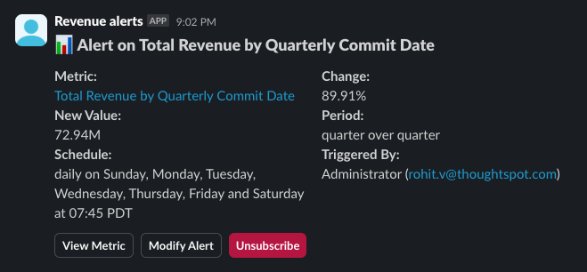

# Slack webhook (Python)

A simple webhook made with Python and FastAPI that forwards a KPI monitor alert through webhooks to a Slack channel. The message would look like this:



This app exposes a single endpoint `/send-to-slack` that accepts POST requests from KPI Monitor. It then builds a Slack message and sends it to a Slack channel configured in the `.env` file.

File structure:

```
slack-webhook-python
├── img
│   └── slack-message.png    # Image of the slack message
├── .devcontainer.json       # Devcontainer configuration
├── .env.example             # Example environment configuration file
├── .gitignore               # Git ignore file
├── main.py                  # Main file that defines the fastapi app and the endpoint
├── README.md                # This file
└── requirements.txt         # Python dependencies
```

## Demo

Open in [Codesandbox](https://githubbox.com/thoughtspot/developer-examples/tree/main/starters/kpi-monitor/slack-webhook-python)

## Documentation

- [Creating a webhook in ThoughtSpot](https://developers.thoughtspot.com/docs/webhooks#_register_a_webhook)
- [Assigning a webhook to a KPI monitor alert](https://developers.thoughtspot.com/docs/webhooks#_assign_webhook_to_a_kpi_monitor_alert)

## Run locally

- Clone the repository

```bash
git clone https://github.com/thoughtspot/developer-examples.git
```

- Change directory to the project

```bash
cd developer-examples/starters/kpi-monitor/slack-webhook-python
```

- Install dependencies

```bash
pip install -r requirements.txt
```

- Configure the environment variables by copying the `.env.example` file to `.env` and setting the variables. It is recommended to use a [Slack developer sandbox](https://api.slack.com/docs/developer-sandbox) while trying out this example. Refer to [Slack documentation](https://api.slack.com/quickstart) to learn how to create a Slack app and get a token. Following are the variables that need to be set:

| Variable        | Description                                             |
| --------------- | ------------------------------------------------------- |
| `SLACK_TOKEN`   | The Slack token for the channel to send the message to. |
| `SLACK_CHANNEL` | The Slack channel to send the message to                |

- Build and run the project

```bash
python main.py
```

The above steps will start the server on port 3000 on your local machine. Now we have to configure the webhook in ThoughtSpot.

- Configure the project in such a way that the endpoint is accessible by your ThoughtSpot instance. Simplest way to do this is by using tools like [ngrok](https://ngrok.com/) but ideally you should deploy the project to a cloud provider like AWS, GCP, Azure, etc. and expose the endpoint to the internet with proper security measures.

- Ensure you have Developer permissions in your ThoughtSpot Cloud instance.

- Create a webhook that points to your deployed endpoint. Read more about creating webhooks in the [documentation](https://developers.thoughtspot.com/docs/webhooks#_register_a_webhook).

- Create an alert and [select your webhook as a custom channel](https://developers.thoughtspot.com/docs/webhooks#_assign_webhook_to_a_kpi_monitor_alert).

- Wait for alert execution to see the result in the Slack channel.

## Technology labels

- Python
- FastAPI
- Slack
- Webhook
