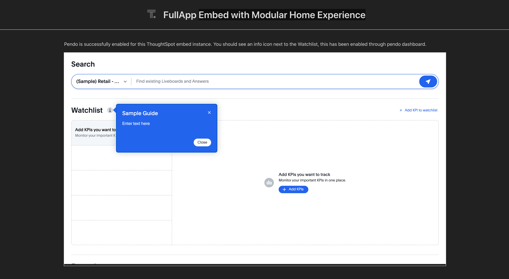

# Pendo Integration with ThoughtSpot Embed

## 🧩 Overview

This project contains a code example for embedded ThoughtSpot developers who are integrating Pendo with a ThoughtSpot Embed instance using the **Third-Party-Tools-For-Embed** feature. This integration allows you to launch Pendo guides and analytics inside an embedded ThoughtSpot instance, enabling product tours, feature announcements, and usage tracking.
[**Third-Party-Tools-For-Embed**: https://developers.thoughtspot.com/docs/external-tool-script-integration]

## 📦 Prerequisites

This project uses the **Third-Party-Tools-For-Embed** feature, which is **not enabled by default** on your ThoughtSpot cluster.

To enable this feature, please contact ThoughtSpot Support and provide the necessary details.

**Enablement Steps:**

1. Host your [integration script for Pendo](https://support.pendo.io/hc/en-us/articles/360046272771-Developer-s-guide-to-implementing-Pendo-using-the-install-script) on a **publicly accessible URL** that serves JavaScript. (In this example, the hosted script is **[`pendoIntegrationScript.js`](pendoIntegrationScript.js)**.) 

   **Alternatively, you can use the pre-hosted script for testing environments:** [https://cdn.jsdelivr.net/gh/quantum29/jsFile@main/Production/pendoIntegration_v1.js](https://cdn.jsdelivr.net/gh/quantum29/jsFile@main/Production/pendoIntegration_v1.js)

2. Share the hosted script URL with ThoughtSpot Support so they can configure it for your cluster. Be sure to share the full URL path, including the .js extension at the end, if your URL includes it.

3. A user with **Admin privileges** needs to go to the **Develop > Security Settings** page in the ThoughtSpot application.

4. Enable the feature by editing the `CSPScriptSrc` field. Also, ensure that the domain where your script is hosted is whitelisted.

📘 For step-by-step enablement instructions, refer to the documentation:  
https://developers.thoughtspot.com/docs/external-tool-script-integration

Once the feature is enabled and your script is configured, you can embed your ThoughtSpot instance as usual. The hosted script will automatically execute within the ThoughtSpot ecosystem once authentication completes. Be sure to pass the correct variables using **[customVariablesForThirdPartyTools](https://developers.thoughtspot.com/docs/Interface_EmbedConfig#_customvariablesforthirdpartytools)** in the init() configuration—your **pendoClientKey**, **pendoAccountConfig**, and **pendoVisitorConfig**.

📘 For guidance on writing your PendoAccountConfig and PendoVisitorConfig, refer to the documentation:
https://support.pendo.io/hc/en-us/articles/21326198721563-Choose-IDs-and-metadata

You can then configure your Pendo guides through the Pendo dashboard. Once configured, the guides will appear inside the embedded ThoughtSpot instance.  

## 🚀 Getting Started

```bash
# 1. Clone the repository
git clone https://github.com/thoughtspot/developer-examples

# 2. Navigate to the example directory
cd visual-embed/pendo-integration

# 3. Install dependencies
npm install

# 4. Update the init config
If you are using your own cluster, make sure to update the init block in App.tsx with your cluster details and your Pendo API key.

# 5. Start the project
npm run dev
```

**Preview:**



## 📚 References

- [Developer Docs](https://developers.thoughtspot.com/docs/introduction)  
- [Third-Party Tools for Embed](https://developers.thoughtspot.com/docs/external-tool-script-integration)  
- [Embed config – customVariablesForThirdPartyTools](https://developers.thoughtspot.com/docs/Interface_EmbedConfig#_customvariablesforthirdpartytools)
- [Quick Start Guide for Embed](https://developers.thoughtspot.com/docs/getting-started)  
- [Developer's Guide to Implementing Pendo Using the Install Script](https://support.pendo.io/hc/en-us/articles/360046272771-Developer-s-guide-to-implementing-Pendo-using-the-install-script)  
- [Choose IDs and Metadata for Pendo Config](https://support.pendo.io/hc/en-us/articles/21326198721563-Choose-IDs-and-metadata)
- [Try this on CodeSandbox](https://codesandbox.io/p/devbox/optimistic-mcclintock-lw2qq8)
