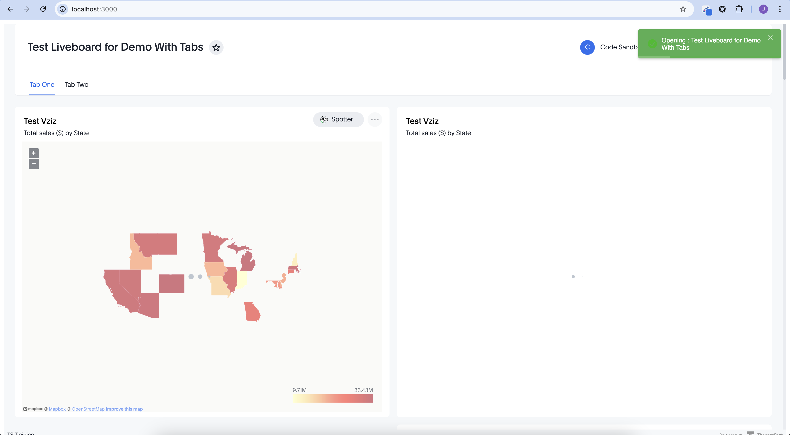

# Route Change Handler

This example demonstrates how to handle route changes in ThoughtSpot embeds using React. It shows how to:

1. Listen for route changes in embedded ThoughtSpot components
2. Extract liveboard IDs from URLs
3. Fetch liveboard metadata using the ThoughtSpot API
4. Display toast notifications for user feedback

## Demo

Open in [Codesandbox](https://githubbox.com/thoughtspot/developer-examples/tree/main/visual-embed/route-change-handler)

## Documentation

- [Visual Embed SDK](https://developers.thoughtspot.com/docs/VisualEmbedSdk)
- [Route Change Embed Event](https://developers.thoughtspot.com/docs/Enumeration_EmbedEvent#_routechange)
- [Metadata API](https://developers.thoughtspot.com/docs/rest-apiv2-search#_search_metadata)

## Run locally

```bash
$ git clone https://github.com/thoughtspot/developer-examples
$ cd visual-embed/route-change-handler
```

```bash
$ npm i
```

```bash
$ npm run dev
```

## Preview

<p align="center">
    
</p>

### Environment Variables

Create a `.env` file in the root directory with the following variables:

```
VITE_THOUGHTSPOT_HOST=your-thoughtspot-host
VITE_THOUGHTSPOT_USERNAME=your-username
VITE_THOUGHTSPOT_PASSWORD=your-password
```

### Technology labels

- React
- TypeScript
- Web
